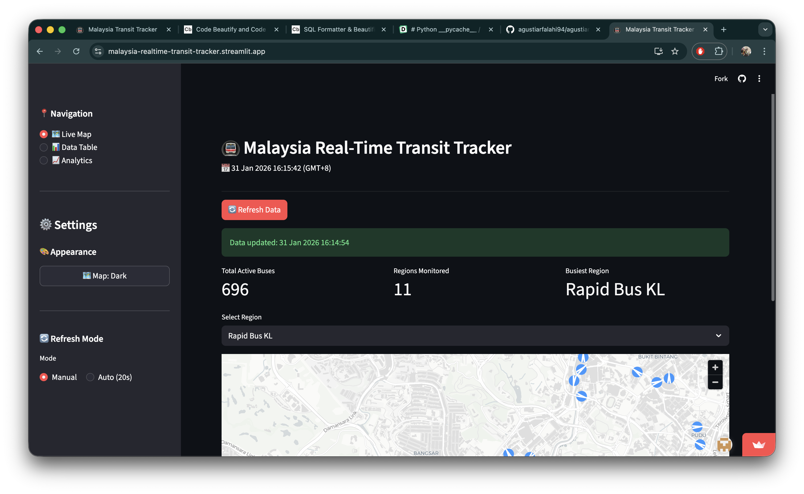
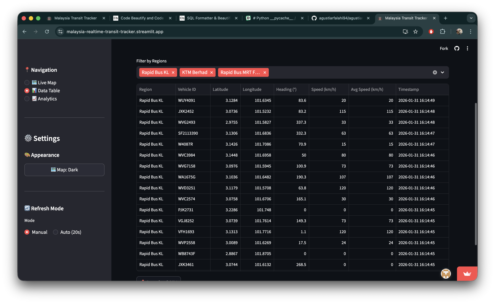
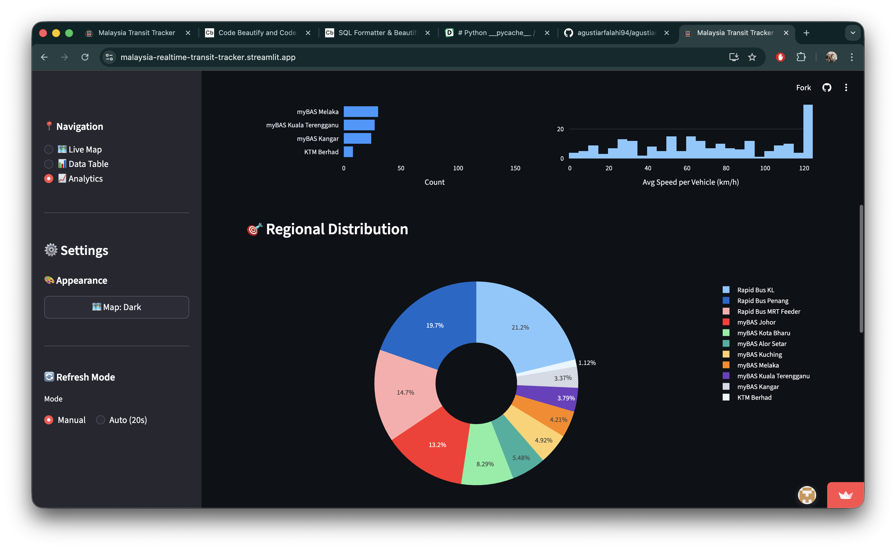

# 🚇 Malaysia Real-Time Transit Tracker

A modern, high-performance web dashboard for tracking live bus positions across Malaysia with real-time updates, interactive visualizations, and comprehensive analytics.

[](https://www.python.org/)
[](https://streamlit.io/)
[](LICENSE)



---

## ✨ Features

### 🗺️ Live Map
- **Real-time tracking** of bus positions across Malaysia
- **Interactive map** with directional arrows showing vehicle movement
- **Region filtering** to focus on specific transit systems
- **Hover tooltips** displaying vehicle ID, speed, and bearing
- **Dark/Light map themes** for better visibility

### 📊 Data Table
- **Sortable, filterable** data table with multi-region selection
- **CSV export** functionality for data analysis
- **Real-time updates** with auto-refresh capability
- **Formatted timestamps** and coordinates

### 📈 Analytics Dashboard
- **Regional distribution** charts (bar chart, pie chart)
- **Speed analysis** with histograms and box plots
- **Summary statistics** (total vehicles, avg/median/max speeds)
- **Interactive visualizations** powered by Plotly

### 🎨 Customization
- **Theme support**: Use Streamlit's built-in light/dark modes
- **Separate map theming**: Independent control for map appearance
- **Auto-refresh**: Manual or automatic updates (20-second intervals)
- **Multi-page navigation**: Easy switching between views

---

## 🚀 Quick Start

### Prerequisites

- Python 3.8 or higher
- pip package manager

### Installation

1. **Clone the repository**
   ```bash
   git clone https://github.com/yourusername/agustiar-data-pipeline.git
   cd agustiar-data-pipeline
   ```

2. **Create virtual environment** (recommended)
   ```bash
   python -m venv .venv
   source .venv/bin/activate  # On Windows: .venv\Scripts\activate
   ```

3. **Install dependencies**
   ```bash
   pip install -r requirements.txt
   ```

4. **Set up configuration**
   ```bash
   cp config_example.py config.py
   # Edit config.py if you want to customize settings
   ```

5. **Run the application**
   ```bash
   cd src
   streamlit run app.py
   ```

6. **Access the dashboard**
   - Open your browser to `http://localhost:8501`
   - Click "Refresh Data" to fetch live transit data

---

## 📁 Project Structure

```
agustiar-data-pipeline/
│
├── src/                              # Main application directory
│   ├── app.py                        # Entry point - main Streamlit app
│   ├── ingestion_rapidbus_mrtfeeder.py  # Data fetching from GTFS API
│   ├── config.py                     # Configuration (not in git)
│   ├── config_example.py             # Configuration template
│   │
│   ├── app_pages/                    # Dashboard pages
│   │   ├── __init__.py
│   │   ├── live_map.py               # Live map with directional arrows
│   │   ├── data_table.py             # Sortable data table view
│   │   └── analytics.py              # Analytics and visualizations
│   │
│   └── utils/                        # Utility modules
│       ├── __init__.py
│       ├── db.py                     # Database operations (DuckDB)
│       └── data_processor.py         # Data processing and formatting
│
├── data/                             # Data directory (excluded from git)
│   └── raw/                          # Raw data storage
│
├── .gitignore                        # Git ignore rules
├── requirements.txt                  # Python dependencies
├── README.md                         # This file
└── LICENSE                           # License file
```

---

## 🎯 Usage Guide

### Dashboard Controls

#### Navigation (Sidebar)
- **📍 Navigation**: Switch between Live Map, Data Table, and Analytics
- **⚙️ Settings**: Configure appearance and refresh behavior

#### Appearance Settings
- **Page Theme**: Click the ⚙️ gear icon (top-right) → Choose app theme
  - Light mode
  - Dark mode  
  - Use system setting
- **Map Theme**: Use sidebar button to toggle between light/dark map styles

#### Refresh Mode
- **Manual**: Click "Refresh Data" button when needed
- **Auto (20s)**: Automatically refreshes every 20 seconds

### Live Map View
1. Select a region from the dropdown menu
2. View buses as **directional arrows** indicating movement
3. Hover over arrows to see:
   - Vehicle ID
   - Current speed (km/h)
   - Direction bearing (degrees)
4. Zoom and pan using standard map controls

### Data Table View
1. Select one or more regions using the multi-select filter
2. Browse the sortable, filterable data table
3. Click column headers to sort
4. Export data using the **"📥 Download CSV"** button

### Analytics View
- **Buses by Region**: Horizontal bar chart showing unique vehicle counts
- **Speed Distribution**: Histogram of average speeds per vehicle
- **Regional Distribution**: Pie chart showing proportional distribution
- **Speed Analysis by Region**: Box plot comparing speed distributions
- **Summary Statistics**: Key metrics (total vehicles, speeds, etc.)

---

## ⚙️ Configuration

### Main Configuration (`config.py`)

| Variable | Type | Default | Description |
|----------|------|---------|-------------|
| `REGIONS` | list | All Malaysia regions | Transit regions to monitor |
| `DATABASE_NAME` | str | `'agustiar_analytics.duckdb'` | DuckDB database filename |
| `DATABASE_TABLE` | str | `'live_buses'` | Table name for vehicle data |
| `TIMEZONE` | str | `'Asia/Kuala_Lumpur'` | Local timezone |
| `UTC_OFFSET_HOURS` | int | `8` | UTC offset for timezone |
| `DEFAULT_ZOOM` | int | `13` | Default map zoom level |
| `ARROW_SIZE` | float | `0.001` | Size multiplier for arrows |
| `ARROW_COLOR_RGB` | list | `[0, 122, 255]` | Arrow color (blue) |
| `CENTER_DOT_COLOR_RGB` | list | `[255, 69, 0]` | Center dot color (orange) |
| `ARROW_OPACITY` | int | `200` | Arrow opacity (0-255) |
| `DATA_MAX_AGE` | int | `3600` | Max data age in seconds (1 hour) |
| `DATA_FUTURE_TOLERANCE` | int | `300` | Future tolerance in seconds (5 min) |

### Adding New Transit Regions

1. Edit `config.py`
2. Add region to `REGIONS` list
3. Add API endpoint to `API_SOURCES` dictionary

Example:
```python
REGIONS = [
    'Rapid Bus KL',
    'New Transit System',  # Add here
    # ...
]

API_SOURCES = {
    'New Transit System': ['api-endpoint'],
    # ...
}
```

---

## 🔧 Technical Details

### Data Pipeline

```
API (GTFS Realtime) → Fetch → Clean → Deduplicate → Store (DuckDB)
                                                           ↓
                                                    Dashboard Pages
                                                           ↓
                                    ┌──────────────────────┼──────────────────────┐
                                    ↓                      ↓                      ↓
                              Live Map              Data Table             Analytics
                           (Last 60s data)        (All history)          (All history)
```

### Data Flow

1. **Ingestion** (`ingestion_rapidbus_mrtfeeder.py`)
   - Fetches data from Malaysia's GTFS Realtime API
   - Validates coordinates and timestamps
   - Deduplicates records
   - Stores in DuckDB

2. **Storage** (`utils/db.py`)
   - DuckDB for efficient local storage
   - Automatic schema migration
   - Optimized queries for fast retrieval

3. **Processing** (`utils/data_processor.py`)
   - Speed conversion (m/s → km/h)
   - Data filtering and cleaning
   - Formatting for display

4. **Visualization** (Pages)
   - Pydeck for interactive maps
   - Plotly for analytics charts
   - Streamlit for UI components

### Performance Optimizations

- ✅ **Single optimized query** per page load (not multiple queries)
- ✅ **Batch operations** instead of row-by-row processing
- ✅ **Efficient deduplication** at database level
- ✅ **60-second data window** for live map (reduces processing)
- ✅ **Reusable helper functions** (DRY principle)

---

## 📊 Data Sources

This application uses data from **Malaysia's Open Data Portal**:

- **API**: [data.gov.my GTFS Realtime](https://developer.data.gov.my/realtime-api/gtfs-realtime)
- **Format**: GTFS Realtime (Protocol Buffers)
- **Coverage**:
  - Rapid Bus (KL, Kuantan, Penang, MRT Feeder)
  - KTM Berhad
  - myBAS (14 regions across Malaysia)
- **Update Frequency**: Real-time

---

## 🛠️ Development

### Project Dependencies

```txt
streamlit>=1.28.0           # Web framework
streamlit-autorefresh>=1.0.1  # Auto-refresh capability
pandas>=2.0.0               # Data manipulation
duckdb>=0.9.0               # Local database
pydeck>=0.8.0               # Map visualization
plotly>=5.14.0              # Analytics charts
requests>=2.31.0            # HTTP requests
gtfs-realtime-bindings>=1.0.0  # GTFS parsing
protobuf>=4.21.0            # Protocol buffers
```

### Development Setup

```bash
# Install development dependencies
pip install -r requirements.txt

# Run in development mode
streamlit run src/app.py --server.runOnSave true
```

### Code Style

This project follows:
- **PEP 8** Python style guide
- **DRY principle** (Don't Repeat Yourself)
- **Clear documentation** for all functions
- **Type hints** where applicable

---

## 🚢 Deployment

### Streamlit Cloud (Recommended)

1. **Push to GitHub**
   ```bash
   git add .
   git commit -m "Ready for deployment"
   git push origin main
   ```

2. **Deploy on Streamlit Cloud**
   - Go to [share.streamlit.io](https://share.streamlit.io)
   - Connect your GitHub repository
   - Set the main file: `src/app.py`
   - Configure secrets (if needed)

3. **Add Secrets** (Optional)
   - In Streamlit Cloud dashboard → Settings → Secrets
   - Add configuration as TOML format:
     ```toml
     [database]
     name = "agustiar_analytics.duckdb"
     table = "live_buses"
     
     [timezone]
     name = "Asia/Kuala_Lumpur"
     utc_offset_hours = 8
     
     [regions]
     list = ["Rapid Bus KL", "KTM Berhad", ...]
     ```

### Local Production

```bash
# Run with production settings
streamlit run src/app.py --server.port 8501 --server.address 0.0.0.0
```

---

## 🐛 Troubleshooting

### No data showing
- Click "Refresh Data" button
- Check internet connection
- Verify API is accessible: https://api.data.gov.my/gtfs-realtime/vehicle-position/

### Map not displaying
- Check map theme setting (try switching between light/dark)
- Ensure coordinates are valid (non-zero values)
- Check browser console for errors

### Performance issues
- Reduce number of selected regions in Data Table
- Use auto-refresh sparingly for large datasets
- Clear browser cache and refresh

### Database errors
- Delete `agustiar_analytics.duckdb` and click "Refresh Data"
- Ensure disk space is available
- Check file permissions

---

## 🤝 Contributing

Contributions are welcome! Please follow these steps:

1. Fork the repository
2. Create a feature branch (`git checkout -b feature/AmazingFeature`)
3. Commit your changes (`git commit -m 'Add some AmazingFeature'`)
4. Push to the branch (`git push origin feature/AmazingFeature`)
5. Open a Pull Request

### Development Guidelines

- Follow PEP 8 style guide
- Add docstrings to all functions
- Write clear commit messages
- Test thoroughly before submitting PR
- Update documentation as needed

---

## 📝 License

This project is licensed under the MIT License - see the [LICENSE](LICENSE) file for details.

---

## 🙏 Acknowledgments

- **Data Provider**: [Malaysia's Open Data Portal](https://data.gov.my)
- **Frameworks**: Built with [Streamlit](https://streamlit.io)
- **Mapping**: Powered by [Pydeck](https://deckgl.readthedocs.io)
- **Charts**: Created with [Plotly](https://plotly.com)
- **Database**: [DuckDB](https://duckdb.org) for efficient local storage

---

## 📧 Contact

**Project Maintainer**: Agustiar Falahi

- GitHub: [@agustiarfalahi94](https://github.com/agustiarfalahi94)
- Email: agustiarfalahi@gmail.com
- Project Link: https://github.com/agustiarfalahi94/agustiar-data-pipeline

---

## 🗺️ Roadmap

- [ ] Historical data visualization (time-series analysis)
- [ ] Route planning and optimization
- [ ] Predictive analytics for arrival times
- [ ] Mobile-responsive improvements
- [ ] API endpoint for programmatic access
- [ ] Integration with more transit systems
- [ ] Real-time alerts and notifications

---

## 📸 Screenshots

### Live Map


### Data Table


### Analytics Dashboard


---

<div align="center">

**[⬆ back to top](#-malaysia-real-time-transit-tracker)**

Made with ❤️ in Malaysia

</div>