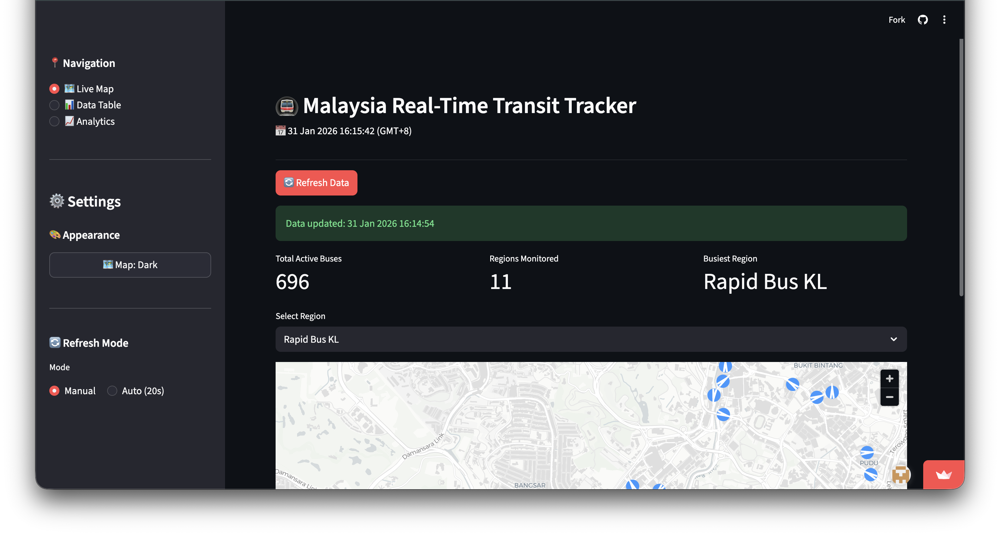

# 🚇 Malaysia Real-Time Transit Tracker

A web dashboard for tracking live bus and rail positions across Malaysia with real-time updates, interactive maps, route visualisation, and comprehensive analytics.

[](https://www.python.org/)
[](https://streamlit.io/)
[](LICENSE)

**🚀 [Live Demo](https://malaysia-realtime-transit-tracker.streamlit.app/)**



---

## ✨ Features

### 🗺️ Live Map
- **Real-time vehicle tracking** across 14 transit regions in Malaysia
- **Directional arrows** showing each vehicle's heading
- **Hover tooltips** — vehicle ID, speed (km/h), and bearing
- **📍 Locate Me** — centres the map on your current GPS location with a red marker
- **🚌 Route Viewer** — select any vehicle to see its planned route (from GTFS Static) or historical breadcrumb trail as a fallback
- **Dark/Light map themes**

### 📊 Data Table
- **Multi-region filtering** with sortable, filterable table
- **CSV export** for offline analysis
- **Audit timestamp** — `created_at` column showing when each record was first ingested
- Auto-refresh compatible

### 📈 Analytics
- **Buses by Region** — bar chart of unique vehicle counts
- **Speed Distribution** — histogram of average speeds per vehicle
- **Regional Distribution** — pie chart
- **Speed Analysis by Region** — box plot comparing regions
- **Summary Statistics** — total vehicles, moving vehicles, max/min/avg/median speed

### ⚙️ Settings & Controls
- **Manual or Auto refresh** (20-second interval)
- **Independent map theme** toggle (separate from the page theme)

---

## 📁 Project Structure

```
agustiar-data-pipeline/
│
├── src/
│   ├── app.py                    # Entry point — Streamlit app shell, navigation, session state
│   ├── config.py                 # Local config (not in git — copy from config.example.py)
│   ├── config.example.py         # Configuration template
│   │
│   ├── app_pages/
│   │   ├── live_map.py           # Live map, Locate Me, Route Viewer
│   │   ├── data_table.py         # Historical data table with CSV export
│   │   └── analytics.py          # Plotly charts and summary statistics
│   │
│   └── utils/
│       ├── ingestion.py          # Parallel GTFS Realtime fetch → DuckDB
│       ├── db.py                 # DuckDB queries and schema migration
│       ├── data_processor.py     # Speed conversion, filtering, display formatting
│       └── gtfs_static.py        # GTFS Static ZIP download, caching, shape/route lookup
│
├── tests/
├── docs/
├── .gitignore
├── requirements.txt
└── README.md
```

---

## 🚀 Quick Start

### Prerequisites
- Python 3.8+
- pip

### Installation

```bash
# 1. Clone
git clone https://github.com/agustiarfalahi94/agustiar-data-pipeline.git
cd agustiar-data-pipeline

# 2. Create virtual environment
python -m venv .venv
source .venv/bin/activate   # Windows: .venv\Scripts\activate

# 3. Install dependencies
pip install -r requirements.txt

# 4. Set up config
cp config.example.py src/config.py
# Edit src/config.py if you want to customise settings

# 5. Run
cd src
streamlit run app.py
```

Open `http://localhost:8501`, then click **Refresh Data** to fetch live transit data.

---

## ⚙️ Configuration

`config.py` (local dev) or Streamlit Secrets (cloud deployment):

| Variable | Default | Description |
|---|---|---|
| `DATABASE_NAME` | `agustiar_analytics.duckdb` | DuckDB filename |
| `DATABASE_TABLE` | `live_buses` | Table name |
| `TIMEZONE` | `Asia/Kuala_Lumpur` | Display timezone |
| `UTC_OFFSET_HOURS` | `8` | UTC offset |
| `DEFAULT_ZOOM` | `13` | Default map zoom level |
| `ARROW_SIZE` | `0.001` | Vehicle arrow size multiplier |
| `DATA_MAX_AGE` | `3600` | Max record age accepted (seconds) |
| `DATA_FUTURE_TOLERANCE` | `300` | Max future timestamp tolerance (seconds) |

### Streamlit Cloud Secrets (TOML)

```toml
[database]
name = "agustiar_analytics.duckdb"
table = "live_buses"

[timezone]
name = "Asia/Kuala_Lumpur"
utc_offset_hours = 8

[map]
default_zoom = 13

[arrow]
size = 0.001

[regions]
list = ["Rapid Bus KL", "KTM Berhad"]
```

---

## 🔧 Technical Details

### Data Pipeline

```
GTFS Realtime API
       │
       ▼ (parallel fetch — ThreadPoolExecutor)
 _fetch_endpoint() × 15 endpoints simultaneously
       │
       ▼
 Validate & filter (bad coords, stale timestamps)
       │
       ▼
 Deduplicate (SQL-level, no re-inserts)
       │
       ▼
     DuckDB
       │
  ┌────┴──────────────┐──────────────────┐
  ▼                   ▼                  ▼
Live Map          Data Table         Analytics
(last 60s)       (all history)      (all history)
```

### Key Design Decisions

| Decision | Reason |
|---|---|
| **Parallel fetch with ThreadPoolExecutor** | Cuts refresh time from ~15s to ~2-3s |
| **DuckDB (local)** | Zero-cost, fast columnar queries, no server needed |
| **Append-only inserts** | Transit positions are facts — never updated, only added |
| **`created_at` audit timestamp** | Tracks when each record entered the system |
| **Hardcoded region dropdown** | Prevents dropdown re-ordering during auto-refresh |
| **GTFS Static 24h cache** | Static schedules change daily at most — avoids hammering the API |
| **`streamlit-js-eval` for geolocation** | `components.html()` is one-way only; `streamlit-js-eval` provides the two-way JS bridge needed to return browser GPS coordinates to Python |

### Route Viewer — How It Works

1. User selects a vehicle in the Route Viewer expander
2. The vehicle's `trip_id` (captured from the realtime feed) is looked up against the **GTFS Static** ZIP for that region (`https://api.data.gov.my/gtfs-static/<agency>`)
3. `trips.txt` → resolves `shape_id` → `shapes.txt` → ordered `[lon, lat]` path
4. Drawn as a green `PathLayer` on the map
5. If no shape is available (optional field in GTFS), falls back to the vehicle's historical breadcrumb trail from DuckDB

### Database Schema (`live_buses`)

| Column | Type | Description |
|---|---|---|
| `region` | VARCHAR | Transit region name |
| `vehicle_id` | VARCHAR | Vehicle identifier |
| `latitude` | DOUBLE | GPS latitude |
| `longitude` | DOUBLE | GPS longitude |
| `bearing` | DOUBLE | Heading in degrees (0–360) |
| `speed` | DOUBLE | Speed in m/s (converted to km/h for display) |
| `timestamp` | BIGINT | Vehicle's reported Unix timestamp |
| `trip_id` | VARCHAR | GTFS trip ID (for route lookup) |
| `route_id` | VARCHAR | GTFS route ID |
| `insert_timestamp` | BIGINT | Unix time when row was inserted |
| `created_at` | TIMESTAMP | Datetime when row was first ingested |

---

## 📊 Data Sources

| Source | URL | Used For |
|---|---|---|
| GTFS Realtime | [api.data.gov.my/gtfs-realtime](https://developer.data.gov.my/realtime-api/gtfs-realtime) | Live vehicle positions |
| GTFS Static | [api.data.gov.my/gtfs-static](https://developer.data.gov.my/realtime-api/gtfs-static) | Route shapes, stop names, schedules |

**Coverage:** Rapid Bus KL, Rapid Bus MRT Feeder, Rapid Bus Kuantan, Rapid Bus Penang, KTM Berhad, myBAS (Kangar, Alor Setar, Kota Bharu, Kuala Terengganu, Ipoh, Seremban, Melaka, Johor, Kuching)

---

## 🛠️ Dependencies

```
streamlit>=1.28.0              # Web framework
streamlit-autorefresh>=1.0.1   # 20s auto-refresh trigger
streamlit-js-eval>=0.1.7       # Browser geolocation bridge
pandas>=2.0.0                  # Data manipulation
duckdb>=0.9.0                  # Local columnar database
numpy>=1.24.0                  # Arrow geometry calculations
pydeck>=0.8.0                  # Interactive map (WebGL)
plotly>=5.14.0                 # Analytics charts
requests>=2.31.0               # HTTP API calls
gtfs-realtime-bindings>=1.0.0  # GTFS Protobuf parsing
protobuf>=4.21.0               # Protocol Buffers
```

---

## 🐛 Troubleshooting

| Problem | Fix |
|---|---|
| No data showing | Click "Refresh Data", check internet connection |
| Map not loading | Toggle map theme (light↔dark), check browser console |
| Locate Me does nothing | Allow location permission in browser when prompted |
| Route Viewer shows "No route data" | That vehicle's region may not have `shapes.txt` in its GTFS Static feed — historical trail is shown as fallback |
| Database errors | Delete `agustiar_analytics.duckdb` and click "Refresh Data" |

---

## 🗺️ Roadmap

- [x] Live vehicle tracking across 14 regions
- [x] Auto-refresh (20s interval)
- [x] Parallel API fetching (ThreadPoolExecutor)
- [x] Historical data table with CSV export
- [x] Analytics dashboard
- [x] Locate Me (browser GPS)
- [x] Route Viewer (GTFS Static planned routes)
- [x] Audit timestamps (`created_at`)
- [ ] Route Planner — enter origin/destination, get transit directions

---

## 📝 License

MIT — see [LICENSE](LICENSE).

---

## 🙏 Acknowledgments

- **Data**: [Malaysia Open Data Portal](https://data.gov.my)
- **Framework**: [Streamlit](https://streamlit.io)
- **Map**: [Pydeck / deck.gl](https://deckgl.readthedocs.io)
- **Charts**: [Plotly](https://plotly.com)
- **Database**: [DuckDB](https://duckdb.org)

---

**Maintainer**: Agustiar Falahi — [@agustiarfalahi94](https://github.com/agustiarfalahi94)

<div align="center"><a href="#-malaysia-real-time-transit-tracker">⬆ back to top</a></div>
