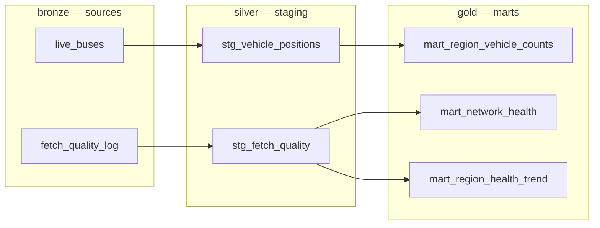

# 🚇 Malaysia Real-Time Transit Tracker

A web dashboard for tracking live bus and rail positions across Malaysia with real-time updates, interactive maps, route visualisation, and comprehensive analytics.

[](https://www.python.org/)
[](https://streamlit.io/)
[](LICENSE)
[](https://github.com/agustiarfalahi94/agustiar-data-pipeline/actions/workflows/ci.yml)

**🚀 [Live Demo](https://malaysia-realtime-transit-tracker.streamlit.app/)**


---

## ✨ Features

### 🗺️ Live Map
- **Real-time vehicle tracking** across 14 transit regions in Malaysia
- **Directional arrows** showing each vehicle's heading
- **Hover tooltips** — vehicle ID, route, speed (km/h), bearing, and the local clock time the
  vehicle last reported (marked ⚠️ stale when it is over a minute old)
- **📍 Locate Me** — centres the map on your current GPS location with a red marker
- **🚌 Route Viewer** — select any vehicle to see its planned route (from GTFS Static) or historical breadcrumb trail as a fallback
- **🔎 Route search** — type a route number or name (e.g. `T580`, or `awan besar`) to show only the vehicles running it; the map recentres on the matches. If nothing matches, it says why — whether the route runs in this region but is quiet, or belongs to a different region (and which). Not available for KTM Berhad, whose realtime feed carries no route ID
- **📍 Arrivals near you** — with your location set, see nearby stops within 800 m and the next
  buses to each, with an estimated arrival for every bus listed. Up to five stops are shown, those
  with a bus inbound first; if more than five have buses coming, the panel says how many were left
  out rather than dropping them silently. Each nearby stop is also drawn on the map as a hollow
  gold ring so its position is visible, not just its name; every stop name in the panel links to
  Google Maps for walking directions. Tap a bus on the map to see when that specific vehicle
  reaches your nearest stop — the tapped panel states the same facts as the stop list for the same
  bus (destination, arrival, lateness, position age), only as labelled lines. Lateness is shown
  only where the feed actually publishes a timetabled start time — almost every Rapid Bus KL trip
  runs to a headway instead, and for those no lateness is claimed (see *No lateness on a headway
  service* under Design Decisions). While a route search is active the panel names the searched
  route in its "nothing inbound" wording, because with the map filtered to one route it has no
  evidence about the others
- **⏳ Freshness tiers** — vehicles reporting within 60s are drawn solid; those up to 5 minutes old
  are dimmed and their tooltip shows when they last reported; older ones are hidden but counted, so
  nothing disappears without explanation
- **Header metrics** — **Active Buses** (everything drawn: fresh + stale), **Stale** (the dimmed
  share of it), **Regions Monitored** and **Busiest Region**. All four are network-wide; the caption
  under the map reports the same counts for the selected region
- **Dark/Light map themes**

### 📊 Data Table
- **Multi-region filtering** with sortable, filterable table
- **CSV export** for offline analysis
- **Audit timestamp** — `created_at` column showing when each record was first ingested
- Auto-refresh compatible

### 📈 Analytics
- **Buses by Region** — bar chart of unique vehicle counts
- **Speed Distribution** — histogram of average speeds per vehicle
- **Regional Distribution** — pie chart
- **Speed Analysis by Region** — box plot comparing regions
- **Summary Statistics** — total vehicles, moving vehicles (non-zero speed among vehicles that
  reported in the last 60s), max/min/avg/median speed

### 📡 Network Health
- **Per-region reliability scorecards** — composite score (0–100) for each of the 14 transit regions
- **Score breakdown** — reporting rate (40%), availability (40%), average data lag (20%). The count of *quiet cycles* (feed answered, no vehicles running) is shown alongside as context — it is not an input to the score
- **24h sparklines** — at-a-glance trend per region, computed by the same rule as the score above it
- **Region drill-down** — reliability score over time, vehicles received vs. rejected per cycle, data lag trend. A region with no scoreable fetch in the window shows a "not scored" note rather than an empty chart
- **Raw Fetch Log** — every API fetch event with full quality metadata **including its `fetch_status`**, CSV export
- **Honest scoring** — feeds withdrawn upstream (HTTP 404) and self-inflicted rate limiting (HTTP 429) are excluded from reliability scores rather than blamed on the agency; a healthy feed reporting no vehicles out of service hours is not counted as an outage. Such a region's card says which of the two happened instead of asserting a cause

### ⚙️ Settings & Controls
- **Manual or Auto refresh** (20-second interval)
- **Independent map theme** toggle (separate from the page theme)

---

## 📁 Project Structure

```
agustiar-data-pipeline/
│
├── src/
│   ├── app.py                    # Entry point — Streamlit app shell, navigation, session state
│   ├── config.py                 # Local config (not in git — copy from config.example.py)
│   ├── config.example.py         # Configuration template
│   │
│   ├── app_pages/
│   │   ├── live_map.py           # Live map, Locate Me, Route Viewer
│   │   ├── data_table.py         # Historical data table with CSV export
│   │   ├── analytics.py          # Plotly charts and summary statistics
│   │   └── network_health.py     # Data quality scorecards, drill-down, fetch log
│   │
│   └── utils/
│       ├── ingestion.py          # Parallel GTFS Realtime fetch → DuckDB
│       ├── db.py                 # DuckDB queries and schema migration
│       ├── data_processor.py     # Speed conversion, filtering, freshness tiers
│       ├── gtfs_static.py        # GTFS Static ZIP download, caching, timetable lookups
│       ├── eta.py                # Arrival estimation — pure, no Streamlit or DuckDB
│       └── dbt_runner.py         # Creates the dbt mart views once, after first ingestion
│
├── transform/                    # dbt-duckdb project (analytics transformation layer)
│   ├── dbt_project.yml
│   ├── profiles.yml
│   ├── macros/
│   │   ├── reliability_score.sql # Single definition of the 0–100 score formula (+ its no-reporting variant)
│   │   ├── test_accepted_range.sql            # Generic test: value within [min, max]
│   │   └── test_unique_combination_of_columns.sql # Generic test: composite-key uniqueness
│   ├── models/
│   │   ├── staging/              # Silver — cleaned views over the raw tables
│   │   └── marts/                # Gold — analytical views read by the app
│   └── seeds/                    # CI fixtures for dbt build/test
│
├── tests/
├── docs/
├── .gitignore
├── requirements.txt
└── README.md
```

---

## 🚀 Quick Start

### Prerequisites
- Python 3.9+ (required by dbt-core; CI runs 3.11)
- pip

### Installation

```bash
# 1. Clone
git clone https://github.com/agustiarfalahi94/agustiar-data-pipeline.git
cd agustiar-data-pipeline

# 2. Create virtual environment
python -m venv .venv
source .venv/bin/activate   # Windows: .venv\Scripts\activate

# 3. Install dependencies
pip install -r requirements.txt

# 4. Set up config
cp src/config.example.py src/config.py
# Edit src/config.py if you want to customise settings

# 5. Run
cd src
streamlit run app.py
```

Open `http://localhost:8501`, then click **Refresh Data** to fetch live transit data.

---

## ⚙️ Configuration

`config.py` (local dev) or Streamlit Secrets (cloud deployment):

| Variable | Default | Description |
|---|---|---|
| `DATABASE_NAME` | `agustiar_analytics.duckdb` | DuckDB filename |
| `DATABASE_TABLE` | `live_buses` | Table name |
| `TIMEZONE` | `Asia/Kuala_Lumpur` | Display timezone |
| `UTC_OFFSET_HOURS` | `8` | UTC offset |
| `DEFAULT_ZOOM` | `13` | Default map zoom level |
| `ARROW_SIZE` | `0.001` | Vehicle arrow size multiplier |
| `DATA_MAX_AGE` | `3600` | Max record age accepted (seconds) |
| `DATA_FUTURE_TOLERANCE` | `300` | Max future timestamp tolerance (seconds) |
| `LIVE_FRESH_SECONDS` | `60` | Vehicles at or under this age are drawn solid |
| `LIVE_STALE_SECONDS` | `300` | Vehicles up to this age are drawn dimmed |
| `LIVE_HIDDEN_SECONDS` | `900` | Vehicles up to this age are counted as hidden; older are not fetched |

The three `LIVE_*` knobs are optional and are read one at a time: a `config.py` copied from an
earlier release simply falls back to the default for each one it lacks, and keeps every setting it
does define. Copy them in from `config.example.py` only if you want to tune the freshness tiers.

### Streamlit Cloud Secrets (TOML)

```toml
[database]
name = "agustiar_analytics.duckdb"
table = "live_buses"

[timezone]
name = "Asia/Kuala_Lumpur"
utc_offset_hours = 8

[map]
default_zoom = 13

[arrow]
size = 0.001

[regions]
list = ["Rapid Bus KL", "KTM Berhad"]
```

---

## 🔧 Technical Details

### Data Pipeline

```
GTFS Realtime API
       │
       ▼ (parallel fetch — ThreadPoolExecutor)
 _fetch_endpoint() × 15 endpoints simultaneously
       │
       ▼
 Validate & filter (bad coords, stale timestamps)
       │
       ▼
 Deduplicate (SQL-level, no re-inserts)
       │
       ▼
     DuckDB
       │                    │
  ┌────┴──────────┬──────────┴──────┬──────────────┐
  ▼               ▼                 ▼               ▼
Live Map      Data Table        Analytics     Network Health
(last 15 min  (7-day history)  (7-day history) (fetch_quality_log)
 fetched;
 5 min drawn)
```

### Key Design Decisions

| Decision | Reason |
|---|---|
| **Parallel fetch with ThreadPoolExecutor** | Cuts refresh time from ~15s to ~2-3s |
| **DuckDB (local)** | Zero-cost, fast columnar queries, no server needed |
| **Append-only inserts** | Transit positions are facts — never updated, only added |
| **`created_at` audit timestamp** | Tracks when each record entered the system |
| **Hardcoded region dropdown** | Prevents dropdown re-ordering during auto-refresh |
| **GTFS Static 24h cache** | Static schedules change daily at most — avoids hammering the API |
| **`streamlit-js-eval` for geolocation** | `components.html()` is one-way only; `streamlit-js-eval` provides the two-way JS bridge needed to return browser GPS coordinates to Python |
| **`fetch_quality_log` table** | Records per-region API quality stats at every fetch — received, rejected, inserted, lag, dropout, and the fetch's `fetch_status` (`OK` / `EMPTY` / `NO_FEED` / `THROTTLED` / `ERROR`), which is what lets the score distinguish an agency outage from a withdrawn feed or our own rate limiting. Powers the Network Health page without touching `live_buses` |
| **Fetch guard (3s window)** | DuckDB only supports one writer at a time; the guard prevents concurrent write collisions when multiple users trigger refresh simultaneously |
| **dbt marts for analytical reads** | Network Health and the Analytics region charts read pre-modelled views, so the scoring logic lives in one tested place instead of inline SQL. The live map keeps its direct query, so positions and their per-second ages are always current |
| **Live window anchored to wall-clock now** | Anchoring to `MAX(timestamp)` let one feed with a fast clock drag the window into the future and black out regions reporting honestly. Ages are clamped at zero so a fast clock reads as current rather than being discarded |
| **15 min fetched, 5 min drawn, 60s solid** | `LIVE_HIDDEN_SECONDS` bounds the query, `LIVE_STALE_SECONDS` bounds what is drawn, `LIVE_FRESH_SECONDS` bounds what is drawn solid. A vehicle between the last two is dimmed rather than deleted, so a 90-second gap in one feed no longer looks like the bus vanished |
| **ETAs from the timetable, not from speed** | The provider publishes no trip updates, so arrivals are derived by joining each vehicle's live `trip_id` to `stop_times.txt`, shifted by its measured delay where one can be measured (see the next row). Instantaneous speed is a poor predictor — a bus at a red light reports 0 km/h |
| **No lateness on a headway service** | 2,099 of the 2,102 Rapid Bus KL trips appear in `frequencies.txt` with `exact_times=0`, so their `stop_times.txt` rows are a travel-time template repeated across an operating window, not scheduled wall-clock times. There is no published start time to be late against, so the delay is reported as unknown rather than computed. The arrival is unaffected — it uses only the *differences* between stop times, which is exactly what a headway template encodes |
| **Nearby stops ranked by usefulness** | Truncating to the closest few stops before computing arrivals hid a stop that had a bus inbound behind five that did not. The nearest 40 stops within the radius are now evaluated (`NEARBY_STOP_SCAN_LIMIT`), then those with a bus coming are shown first, at most five of them (`NEARBY_STOP_DISPLAY`). The 40 is a bound on work, not a claim of completeness: measured against the feed, the largest 800 m neighbourhood in the Rapid KL network is 41 stops and the median is 13, so the cap bites in exactly one place on the network. Any served stops past the five shown are counted in the panel rather than dropped in silence |

### Route Viewer — How It Works

1. User selects a vehicle in the Route Viewer expander
2. The vehicle's `trip_id` (captured from the realtime feed) is looked up against the **GTFS Static** ZIP for that region (`https://api.data.gov.my/gtfs-static/<agency>`)
3. `trips.txt` → resolves `shape_id` → `shapes.txt` → ordered `[lon, lat]` path
4. Drawn as a green `PathLayer` on the map
5. If no shape is available (optional field in GTFS), falls back to the vehicle's historical breadcrumb trail from DuckDB

### Database Schema (`live_buses`)

| Column | Type | Description |
|---|---|---|
| `region` | VARCHAR | Transit region name |
| `vehicle_id` | VARCHAR | Vehicle identifier |
| `latitude` | DOUBLE | GPS latitude |
| `longitude` | DOUBLE | GPS longitude |
| `bearing` | DOUBLE | Heading in degrees (0–360) |
| `speed` | DOUBLE | Speed in m/s (converted to km/h for display) |
| `timestamp` | BIGINT | Vehicle's reported Unix timestamp |
| `trip_id` | VARCHAR | GTFS trip ID (for route lookup) |
| `route_id` | VARCHAR | GTFS route ID |
| `insert_timestamp` | BIGINT | Unix time when row was inserted |
| `created_at` | TIMESTAMP | Datetime when row was first ingested |

### Database Schema (`fetch_quality_log`)

One row per region per fetch cycle. Powers the Network Health page.

| Column | Type | Description |
|---|---|---|
| `fetch_timestamp` | BIGINT | Unix time when the fetch cycle ran |
| `region` | VARCHAR | Transit region name |
| `vehicles_received` | INTEGER | Raw count from API before any filtering |
| `vehicles_rejected` | INTEGER | Filtered out (bad coords or stale timestamps) |
| `vehicles_inserted` | INTEGER | Actually written to `live_buses` after dedup |
| `avg_data_lag_seconds` | DOUBLE | Average of `insert_timestamp − vehicle_timestamp` |
| `max_data_lag_seconds` | DOUBLE | Worst lag observed in this fetch |
| `total_dropout` | BOOLEAN | True if API returned zero vehicles for this region |
| `fetch_duration_ms` | INTEGER | Wall-clock time for this region's HTTP fetch |
| `fetch_status` | VARCHAR | `OK`, `EMPTY`, `NO_FEED` (404), `THROTTLED` (429) or `ERROR` |

---

### Data Modeling (dbt)

Analytical transformations live in a dbt project (`transform/`, dbt-duckdb adapter) as a
bronze → silver → gold medallion model. The live-map path stays on direct DuckDB queries so
positions and their per-second ages are always current; only the analytical pages read dbt marts.

| Layer | Model | Grain | Feeds |
|---|---|---|---|
| source (bronze) | `live_buses`, `fetch_quality_log` | raw rows | — |
| staging (silver) | `stg_vehicle_positions`, `stg_fetch_quality` | cleaned rows | marts |
| mart (gold) | `mart_network_health` | region (24h) | Network Health scorecards |
| mart (gold) | `mart_region_health_trend` | region × fetch cycle | drill-down charts |
| mart (gold) | `mart_region_vehicle_counts` | region | Analytics bar + pie |

The reliability-score formula is a single dbt macro (`reliability_score`) shared by the two
health marts, with a companion `reliability_score_without_reporting` for a fetch cycle that
received nothing — its reporting rate is undefined rather than zero, so that term is dropped and
the remaining weights renormalised. Both marts apply that rule, which is what keeps a region's
scorecard and the sparkline beneath it from telling different stories about the same window.

The marts are **views**, so an app upgraded against an existing database would otherwise keep the
previous release's SQL. `dbt_runner.ensure_dbt_models` therefore checks not just that the marts
exist but that they carry the current schema, and re-runs dbt when they do not.

Data quality is enforced by dbt tests — region `accepted_values`, 0–100 score
range, 0–1 rate range, and key uniqueness including the trend mart's `region + fetch_timestamp`
grain — which CI runs via `dbt build`. `fetch_quality_log` also declares a freshness policy,
checked by a separate `dbt source freshness` step in CI (`dbt build` does not run freshness);
that step is informational only, because the committed fixtures carry fixed, old timestamps.

The project has **no dbt package dependencies** — the generic tests it needs (`accepted_range`,
`unique_combination_of_columns`) are defined locally in `transform/macros/`. That keeps `dbt run`
working on a fresh clone and on Streamlit Cloud, where no `dbt deps` step exists.


```mermaid
flowchart LR
  subgraph bronze["bronze — sources"]
    A[live_buses]
    B[fetch_quality_log]
  end
  subgraph silver["silver — staging"]
    C[stg_vehicle_positions]
    D[stg_fetch_quality]
  end
  subgraph gold["gold — marts"]
    E[mart_region_vehicle_counts]
    F[mart_network_health]
    G[mart_region_health_trend]
  end
  A --> C --> E
  B --> D --> F
  D --> G
```

The lineage diagram above is **Mermaid**, not a screenshot: it is version-controlled, reviewed in
diffs, rendered natively by GitHub, and so cannot silently go stale the way a committed PNG does.
For the full interactive graph — column-level docs, tests, and compiled SQL per node — run
`dbt docs generate && dbt docs serve` as shown below.

Run locally against your own database:

    export DBT_DUCKDB_PATH="$(pwd)/src/agustiar_analytics.duckdb"
    dbt run  --project-dir transform --profiles-dir transform
    dbt test --project-dir transform --profiles-dir transform

> **Use `dbt run`, not `dbt build`, against a database you care about.** The seeds under
> `transform/seeds/` are CI fixtures deliberately named after the real tables (`live_buses`,
> `fetch_quality_log`). They are disabled on every target except `ci`, so this is belt-and-braces
> — but `dbt run` never loads seeds at all. Seeded runs belong on a throwaway database:
> `dbt build --target ci ...`. The `ci` target reads its DuckDB path from its **own** env var,
> `DBT_CI_DUCKDB_PATH` (default `ci.duckdb`, created relative to wherever `dbt` is invoked from
> — repo root in the commands above and in CI) — it never falls back to `DBT_DUCKDB_PATH`, so
> `--target ci` cannot resolve to the same file as `dev` no matter what you've exported above.

For the full interactive lineage graph:

    dbt docs generate --project-dir transform --profiles-dir transform
    dbt docs serve --project-dir transform --profiles-dir transform

---

## 📊 Data Sources

| Source | URL | Used For |
|---|---|---|
| GTFS Realtime | [api.data.gov.my/gtfs-realtime](https://developer.data.gov.my/realtime-api/gtfs-realtime) | Live vehicle positions |
| GTFS Static | [api.data.gov.my/gtfs-static](https://developer.data.gov.my/realtime-api/gtfs-static) | Route shapes, stop names, schedules |

**Coverage:** Rapid Bus KL, Rapid Bus MRT Feeder, Rapid Bus Kuantan, Rapid Bus Penang, KTM Berhad, myBAS (Kangar, Alor Setar, Kota Bharu, Kuala Terengganu, Ipoh, Seremban, Melaka, Johor, Kuching)

---

## 🛠️ Dependencies

```
streamlit>=1.40.0              # Web framework
streamlit-autorefresh>=1.0.1   # 20s auto-refresh trigger
streamlit-js-eval>=0.1.7       # Browser geolocation bridge
pandas>=2.0.0                  # Data manipulation
duckdb>=0.9.0                  # Local columnar database
numpy>=1.24.0                  # Arrow geometry calculations
pydeck>=0.8.0                  # Interactive map (WebGL)
plotly>=5.14.0                 # Analytics charts
requests>=2.31.0               # HTTP API calls
gtfs-realtime-bindings>=1.0.0  # GTFS Protobuf parsing
protobuf>=4.21.0               # Protocol Buffers
dbt-duckdb>=1.7.0,<2.0.0       # Analytics transformation layer (transform/)
```

---

## 🐛 Troubleshooting

| Problem | Fix |
|---|---|
| No data showing | Click "Refresh Data", check internet connection |
| Map not loading | Toggle map theme (light↔dark), check browser console |
| Locate Me does nothing | Allow location permission in browser when prompted |
| Route Viewer shows "No route data" | That vehicle's region may not have `shapes.txt` in its GTFS Static feed — historical trail is shown as fallback |
| Hovering a nearby-stop marker shows nothing | Expected — stop markers are deliberately not interactive (hover doesn't exist on the touch devices this app is used on). Stop names and Google Maps links are in the panel below the map |
| Database errors | Delete `agustiar_analytics.duckdb` and click "Refresh Data" |

---

## 🗺️ Roadmap

- [x] Live vehicle tracking across 14 regions
- [x] Auto-refresh (20s interval)
- [x] Parallel API fetching (ThreadPoolExecutor)
- [x] Historical data table with CSV export
- [x] Analytics dashboard
- [x] Locate Me (browser GPS)
- [x] Route Viewer (GTFS Static planned routes)
- [x] Audit timestamps (`created_at`)
- [x] Network Health page — per-region reliability scores and fetch quality log
- [x] dbt analytics layer — bronze/silver/gold models, data tests, CI
- [x] Search by route name — type a route (e.g. `T580`) and see every vehicle on that
      route live on the map, instead of looking up an opaque vehicle ID
- [x] Arrivals near you — stop-centric ETAs derived from the published timetable

> **Not planned: a full route planner.** Origin→destination journey planning is well served
> by Google Maps and this app would not improve on it. The gap worth filling is the opposite
> one: you already know your route — you just want to see where *that* bus is right now.

---

## 📝 License

MIT — see [LICENSE](LICENSE).

---

## 🙏 Acknowledgments

- **Data**: [Malaysia Open Data Portal](https://data.gov.my)
- **Framework**: [Streamlit](https://streamlit.io)
- **Map**: [Pydeck / deck.gl](https://deckgl.readthedocs.io)
- **Charts**: [Plotly](https://plotly.com)
- **Database**: [DuckDB](https://duckdb.org)

---

**Maintainer**: Agustiar Falahi — [@agustiarfalahi94](https://github.com/agustiarfalahi94)

<div align="center"><a href="#-malaysia-real-time-transit-tracker">⬆ back to top</a></div>
