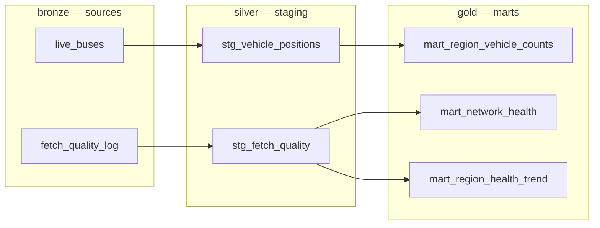

# 🚇 Malaysia Real-Time Transit Tracker

A web dashboard for tracking live bus and rail positions across Malaysia with real-time updates, interactive maps, route visualisation, and comprehensive analytics.

[](https://www.python.org/)
[](https://streamlit.io/)
[](LICENSE)
[](https://github.com/agustiarfalahi94/agustiar-data-pipeline/actions/workflows/ci.yml)

**🚀 [Live Demo](https://malaysia-realtime-transit-tracker.streamlit.app/)**


---

## ✨ Features

### 🗺️ Live Map
- **Real-time vehicle tracking** across 14 transit regions in Malaysia
- **Directional arrows** showing each vehicle's heading
- **Hover tooltips** — vehicle ID, route, speed (km/h), bearing, and the local clock time the
  vehicle last reported (marked ⚠️ stale when it is over a minute old)
- **📍 Locate Me** — centres the map on your current GPS location with a red marker
- **🚌 Route Viewer** — select any vehicle to see its planned route (from GTFS Static) or historical breadcrumb trail as a fallback
- **🔎 Route search** — type a route number or name (e.g. `T580`, or `awan besar`) to show only the vehicles running it; the map recentres on the matches. If nothing matches, it says why — whether the route runs in this region but is quiet, or belongs to a different region (and which). Not available for KTM Berhad, whose realtime feed carries no route ID
- **🎨 Search by what's painted on the bus** — a rider reads `GOKL14` on the front of the vehicle,
  but the feed publishes that route as `PAVILION BUKIT JALIL (PAVBJ)`; no `GOKL` route exists
  anywhere in the feed, the connection lives only on the livery. Searching `GOKL14` resolves it to
  the published name via a small hand-maintained table and shows a caption saying so —
  *"'GOKL14' is the name on the bus. This app links it by hand to **PAVILION BUKIT JALIL
  (PAVBJ)**, the route the feed publishes — that link is ours, not the operator's, and nothing in
  the feed confirms it."* — so a guess from this table is never mistaken for feed data. Only names in that
  table are ever rewritten; searching a real feed name (`T580`) behaves exactly as before with no
  such caption
- **🗺️ The map survives a quiet feed** — a region reporting zero vehicles (an upstream outage, or
  simply no service running right now) no longer takes the whole map down with it. Your location
  marker, the nearby stop rings, and the tapped-stop panel all come from the published timetable
  and your own GPS, neither of which needs a live vehicle to exist — only the vehicle layer itself
  and its "Showing N active vehicles" caption are skipped, replaced by a warning naming which of
  three things happened: nothing reported, what reported had unusable coordinates, or everything on
  hand is too old to draw. The camera also re-centres correctly the moment a quiet region's buses
  start reporting again, rather than staying parked on your marker while vehicles are drawn
  off-screen
- **📍 Arrivals near you** — with your location set, see nearby stops, starting at 800 m
  (straight-line) and widening once to 1500 m if nothing is found there, with the panel naming
  which radius was actually used. If neither radius finds a stop, the app checks the other regions
  and names one that does have stops nearby — with a stop count and distance — rather than leaving
  a dead end; this cross-region scan skips any agency whose timetable can't be read, so one broken
  feed can't cost you the other twelve answers. The panel also lists the next buses to each stop,
  each with a route-first, labelled line: `Route T580 → Awan Besar ·
  arrives ~6 min · 2 min late · position 3 min old`. Up to five stops are shown, those with a bus
  inbound first; if more than five have buses coming, the panel says how many were left out rather
  than dropping them silently. Each nearby stop is also drawn on the map as a gold ring, faintly
  filled so the whole disc is tappable and not only its outline — deck.gl only picks drawn pixels,
  so a fully hollow ring used to miss a tap that landed in its centre. Tapping anywhere in a stop
  ring, or clicking its name in the list below, opens the same panel with that stop's name,
  distance, walk time, and the buses en route to it; a selected stop's ring is drawn brighter and
  thicker so it's clear which one is open. Tap a bus
  on the map instead to see when that specific vehicle reaches your nearest stop — the panel states
  the same facts as the stop list for the same bus (destination, arrival, lateness, position age),
  only as labelled lines, and is bounded by the same radius the stop list actually searched, so the
  two panels can never disagree about whether a bus comes near you. The last tap wins between a stop panel and a bus panel. Lateness is shown
  only where the feed actually publishes a timetabled start time — almost
  every Rapid Bus KL trip runs to a headway instead, and for those no lateness is claimed (see *No
  lateness on a headway service* under Design Decisions). While a route search is active the panel
  names the searched route in its "nothing inbound" wording, because with the map filtered to one
  route it has no evidence about the others
- **🚏 Serves** — the tapped-stop panel lists every route the timetable says calls at that stop,
  including a route with no bus currently running. The arrival list above it only ever shows a
  route with a live vehicle inbound, which is a much smaller set: at KL2324 LRT AWAN BESAR that
  used to mean three routes on screen — `651`, `652`, `PAVILION BUKIT JALIL (PAVBJ)` — and no way
  to learn that a fourth, `T580`, also serves the stop and is the only one that reaches KL1743
  GREEN AVENUE CONDOMINIUM. Each served route opens to a collapsed expander per stop pattern (a
  route running more than one distinct stop sequence gets one expander per sequence, never merged)
  showing the full stop list with journey times measured from the stop you tapped, every occurrence
  of that stop marked, and stops within walking distance annotated with a distance and walk time —
  drawn from the same nearby-stop scan the panel below uses, resolved for the marked stops only. Journey times are differences between timetabled stop times, not
  live predictions; a route running to a headway is labelled as such rather than showing a fabricated
  departure time. This is not a journey planner — it answers "does this bus stop at X and how far
  along is it", not "how do I get from A to B"
- **🚶 Walk times** — each nearby stop's walk time comes from OpenRouteService's Matrix API routed
  along real footpaths (`~9 min walk`) when `ORS_API_KEY` is configured, falling back to a
  straight-line estimate (`~5 min walk (estimated)`) otherwise or on any request failure. Straight
  lines can be badly wrong: measured from one KL neighbourhood, a stop 60 m away in a straight line
  was 634 m and about ten minutes on foot because of an uncrossable barrier between it and the
  user. Each stop's name in the panel is a button that selects it (the same selection a ring tap
  sets); a separate **Google Maps** link beside it opens walking directions, which this app
  deliberately does not compute itself
- **⏳ Freshness tiers** — vehicles reporting within 60s are drawn solid; those up to 5 minutes old
  are dimmed and their tooltip shows when they last reported; older ones are hidden but counted, so
  nothing disappears without explanation
- **Header metrics** — **Active Buses** (everything drawn: fresh + stale), **Stale** (the dimmed
  share of it), **Regions Monitored** and **Busiest Region**. All four are network-wide; the caption
  under the map reports the same counts for the selected region
- **Dark/Light map themes**

### 📊 Data Table
- **Multi-region filtering** with sortable, filterable table
- **CSV export** for offline analysis
- **Audit timestamp** — `created_at` column showing when each record was first ingested
- Auto-refresh compatible

### 📈 Analytics
- **Buses by Region** — bar chart of unique vehicle counts
- **Speed Distribution** — histogram of average speeds per vehicle
- **Regional Distribution** — pie chart
- **Speed Analysis by Region** — box plot comparing regions
- **Summary Statistics** — total vehicles, moving vehicles (non-zero speed among vehicles that
  reported in the last 60s), max/min/avg/median speed

### 📡 Network Health
- **Per-region reliability scorecards** — composite score (0–100) for each of the 14 transit regions
- **Score breakdown** — reporting rate (40%), availability (40%), average data lag (20%). The count of *quiet cycles* (feed answered, no vehicles running) is shown alongside as context — it is not an input to the score
- **When buses were last seen** — each card also states `buses last seen 3h ago` or `no buses reported in this window`. The score measures whether the **feed** is answering, not whether **buses** are running: a feed correctly reporting no service scores full marks, so a green *Reliable* card can sit above an empty Live Map. These are separate facts and the card now says both
- **24h sparklines** — at-a-glance trend per region, computed by the same rule as the score above
  it. Hovering a point names the clock time it was measured at and the score then, e.g.
  `18:20 · score 100`
- **Region drill-down** — reliability score over time, vehicles received vs. rejected per cycle, data lag trend. A region with no scoreable fetch in the window shows a "not scored" note rather than an empty chart
- **Raw Fetch Log** — every API fetch event with full quality metadata **including its `fetch_status`**, CSV export
- **Honest scoring** — feeds withdrawn upstream (HTTP 404) and self-inflicted rate limiting (HTTP 429) are excluded from reliability scores rather than blamed on the agency; a healthy feed reporting no vehicles out of service hours is not counted as an outage. Such a region's card says which of the two happened instead of asserting a cause

### ⚙️ Settings & Controls
- **Manual or Auto refresh** (20-second interval)
- **Independent map theme** toggle (separate from the page theme)

---

## 🚶 How to Use This App

This section is for riders, not developers — see [Quick Start](#-quick-start) below to run the
project itself.

**What each page answers:**

| Page | Question it answers |
|---|---|
| 🗺️ Live Map | Where are the buses/trains right now, and how do I get to the nearest stop? |
| 📊 Data Table | What raw records has the app collected, and can I export them? |
| 📈 Analytics | What does traffic across the network look like over time? |
| 📡 Network Health | Is each region's live feed actually answering? |

**Start with Locate Me.** Most of what the Live Map can tell you — nearby stops, walk times,
arrivals, which region you should even be looking at — starts from knowing where you are. Tap
**📍 Locate Me** first; everything below assumes it has been done.

**A walk time marked `(estimated)` is a straight line, not a route.** Without an OpenRouteService
key configured, the app estimates a walk from crow-flight distance and a fixed detour allowance —
close on a regular street grid, badly wrong across a river, a highway, or a gated compound (one
measured stop was 60 m away by crow-flight and 634 m, ten minutes, on foot). To get an actual
routed time and drop the `(estimated)` suffix, set `ORS_API_KEY` (see
[Configuration](#-configuration)) — it's free to sign up for at OpenRouteService.

**A green "Reliable" score and an empty map are not a contradiction.** The Network Health score
measures one thing only — is the region's feed answering when asked? A feed that correctly reports
"no vehicles right now" (buses out of service overnight, for instance) still scores full marks,
because it did its job: it told the truth. So Rapid Bus KL can show **100 · Reliable** at the same
moment its Live Map shows no buses moving. If you want to know whether service is actually running,
look at the "buses last seen" line on the scorecard or the warning banner above the map itself —
not the score.

**If a region shows no stops near you**, the app now widens its search from 800 m out to 1500 m
before giving up, and if that still finds nothing it checks the *other* thirteen regions and names
one that does have stops nearby, with a stop count and distance, so you know where to switch. It
only does this as a last resort — a normal render never scans every region.

**Journey times in the Live Map come from the published timetable, not from live vehicle
positions.** "`+6 min`" on a stop sequence means the schedule says the bus is 6 timetabled minutes
from where you tapped, not that a real bus is currently 6 minutes away — for that, use the arrivals
list instead, which does read the live feed.

**Route search understands the name painted on the bus, not only the name in the data feed** —
but only for a small, hand-maintained, and *unofficial* list of aliases. Searching `GOKL14` finds
the route the feed itself calls `PAVILION BUKIT JALIL (PAVBJ)`, because that's the number riders
actually see on the livery; the app discloses when a match came from this alias table rather than
from the feed. If an operator repaints or renumbers a route, this table will not know until someone
updates it by hand.

---

## 📁 Project Structure

```
agustiar-data-pipeline/
│
├── src/
│   ├── app.py                    # Entry point — Streamlit app shell, navigation, session state
│   ├── config.py                 # Local config (not in git — copy from config.example.py)
│   ├── config.example.py         # Configuration template
│   │
│   ├── app_pages/
│   │   ├── live_map.py           # Live map, Locate Me, Route Viewer
│   │   ├── data_table.py         # Historical data table with CSV export
│   │   ├── analytics.py          # Plotly charts and summary statistics
│   │   └── network_health.py     # Data quality scorecards, drill-down, fetch log
│   │
│   └── utils/
│       ├── ingestion.py          # Parallel GTFS Realtime fetch → DuckDB
│       ├── db.py                 # DuckDB queries and schema migration
│       ├── data_processor.py     # Speed conversion, filtering, freshness tiers
│       ├── gtfs_static.py        # GTFS Static ZIP download, caching, timetable lookups
│       ├── eta.py                # Arrival estimation — pure, no Streamlit or DuckDB
│       ├── walking.py            # Routed walk times (OpenRouteService), straight-line fallback
│       └── dbt_runner.py         # Creates the dbt mart views once, after first ingestion
│
├── transform/                    # dbt-duckdb project (analytics transformation layer)
│   ├── dbt_project.yml
│   ├── profiles.yml
│   ├── macros/
│   │   ├── reliability_score.sql # Single definition of the 0–100 score formula (+ its no-reporting variant)
│   │   ├── test_accepted_range.sql            # Generic test: value within [min, max]
│   │   └── test_unique_combination_of_columns.sql # Generic test: composite-key uniqueness
│   ├── models/
│   │   ├── staging/              # Silver — cleaned views over the raw tables
│   │   └── marts/                # Gold — analytical views read by the app
│   └── seeds/                    # CI fixtures for dbt build/test
│
├── tests/
├── docs/
├── .gitignore
├── requirements.txt
└── README.md
```

---

## 🚀 Quick Start

### Prerequisites
- Python 3.9+ (required by dbt-core; CI runs 3.11)
- pip

### Installation

```bash
# 1. Clone
git clone https://github.com/agustiarfalahi94/agustiar-data-pipeline.git
cd agustiar-data-pipeline

# 2. Create virtual environment
python -m venv .venv
source .venv/bin/activate   # Windows: .venv\Scripts\activate

# 3. Install dependencies
pip install -r requirements.txt

# 4. Set up config
cp src/config.example.py src/config.py
# Edit src/config.py if you want to customise settings

# 5. Run
cd src
streamlit run app.py
```

Open `http://localhost:8501`, then click **Refresh Data** to fetch live transit data.

---

## ⚙️ Configuration

`config.py` (local dev) or Streamlit Secrets (cloud deployment):

| Variable | Default | Description |
|---|---|---|
| `DATABASE_NAME` | `agustiar_analytics.duckdb` | DuckDB filename |
| `DATABASE_TABLE` | `live_buses` | Table name |
| `TIMEZONE` | `Asia/Kuala_Lumpur` | Display timezone |
| `UTC_OFFSET_HOURS` | `8` | UTC offset |
| `DEFAULT_ZOOM` | `13` | Default map zoom level |
| `ARROW_SIZE` | `0.001` | Vehicle arrow size multiplier |
| `DATA_MAX_AGE` | `3600` | Max record age accepted (seconds) |
| `DATA_FUTURE_TOLERANCE` | `300` | Max future timestamp tolerance (seconds) |
| `LIVE_FRESH_SECONDS` | `60` | Vehicles at or under this age are drawn solid |
| `LIVE_STALE_SECONDS` | `300` | Vehicles up to this age are drawn dimmed |
| `LIVE_HIDDEN_SECONDS` | `900` | Vehicles up to this age are counted as hidden; older are not fetched |
| `ORS_API_KEY` | *(unset)* | OpenRouteService key for real walking distances. Optional — see *Streamlit Cloud Secrets* below and *Troubleshooting* for what happens without one |

The three `LIVE_*` knobs are optional and are read one at a time: a `config.py` copied from an
earlier release simply falls back to the default for each one it lacks, and keeps every setting it
does define. Copy them in from `config.example.py` only if you want to tune the freshness tiers.

### Streamlit Cloud Secrets (TOML)

```toml
[database]
name = "agustiar_analytics.duckdb"
table = "live_buses"

[timezone]
name = "Asia/Kuala_Lumpur"
utc_offset_hours = 8

[map]
default_zoom = 13

[arrow]
size = 0.001

[regions]
list = ["Rapid Bus KL", "KTM Berhad"]

[routing]
api_key = "your-openrouteservice-key"
```

The sectioned `[routing]` form above is canonical — use it. A flat `api_key = "..."` at the top
level (no `[routing]` header) is also accepted as a fallback, because that is what a reader pasting
a single copied line tends to produce; if both are present, `[routing]` wins. Getting the section
header wrong used to fail silently and indistinguishably from having no key configured at all —
every walk time stayed `(estimated)` with nothing saying why.

---

## 🔧 Technical Details

### Data Pipeline

```
GTFS Realtime API
       │
       ▼ (parallel fetch — ThreadPoolExecutor)
 _fetch_endpoint() × 15 endpoints simultaneously
       │
       ▼
 Validate & filter (bad coords, stale timestamps)
       │
       ▼
 Deduplicate (SQL-level, no re-inserts)
       │
       ▼
     DuckDB
       │                    │
  ┌────┴──────────┬──────────┴──────┬──────────────┐
  ▼               ▼                 ▼               ▼
Live Map      Data Table        Analytics     Network Health
(last 15 min  (7-day history)  (7-day history) (fetch_quality_log)
 fetched;
 5 min drawn)
```

### Key Design Decisions

| Decision | Reason |
|---|---|
| **Parallel fetch with ThreadPoolExecutor** | Cuts refresh time from ~15s to ~2-3s |
| **DuckDB (local)** | Zero-cost, fast columnar queries, no server needed |
| **Append-only inserts** | Transit positions are facts — never updated, only added |
| **`created_at` audit timestamp** | Tracks when each record entered the system |
| **Hardcoded region dropdown** | Prevents dropdown re-ordering during auto-refresh |
| **GTFS Static 24h cache** | Static schedules change daily at most — avoids hammering the API |
| **`streamlit-js-eval` for geolocation** | `components.html()` is one-way only; `streamlit-js-eval` provides the two-way JS bridge needed to return browser GPS coordinates to Python |
| **`fetch_quality_log` table** | Records per-region API quality stats at every fetch — received, rejected, inserted, lag, dropout, and the fetch's `fetch_status` (`OK` / `EMPTY` / `NO_FEED` / `THROTTLED` / `ERROR`), which is what lets the score distinguish an agency outage from a withdrawn feed or our own rate limiting. Powers the Network Health page without touching `live_buses` |
| **Fetch guard (3s window)** | DuckDB only supports one writer at a time; the guard prevents concurrent write collisions when multiple users trigger refresh simultaneously |
| **dbt marts for analytical reads** | Network Health and the Analytics region charts read pre-modelled views, so the scoring logic lives in one tested place instead of inline SQL. The live map keeps its direct query, so positions and their per-second ages are always current |
| **Live window anchored to wall-clock now** | Anchoring to `MAX(timestamp)` let one feed with a fast clock drag the window into the future and black out regions reporting honestly. Ages are clamped at zero so a fast clock reads as current rather than being discarded |
| **15 min fetched, 5 min drawn, 60s solid** | `LIVE_HIDDEN_SECONDS` bounds the query, `LIVE_STALE_SECONDS` bounds what is drawn, `LIVE_FRESH_SECONDS` bounds what is drawn solid. A vehicle between the last two is dimmed rather than deleted, so a 90-second gap in one feed no longer looks like the bus vanished |
| **ETAs from the timetable, not from speed** | The provider publishes no trip updates, so arrivals are derived by joining each vehicle's live `trip_id` to `stop_times.txt`, shifted by its measured delay where one can be measured (see the next row). Instantaneous speed is a poor predictor — a bus at a red light reports 0 km/h |
| **No lateness on a headway service** | 2,099 of the 2,102 Rapid Bus KL trips appear in `frequencies.txt` with `exact_times=0`, so their `stop_times.txt` rows are a travel-time template repeated across an operating window, not scheduled wall-clock times. There is no published start time to be late against, so the delay is reported as unknown rather than computed. The arrival is unaffected — it uses only the *differences* between stop times, which is exactly what a headway template encodes |
| **Nearby stops ranked by usefulness** | Truncating to the closest few stops before computing arrivals hid a stop that had a bus inbound behind five that did not. The nearest 40 stops within the radius are now evaluated (`NEARBY_STOP_SCAN_LIMIT`), then those with a bus coming are shown first, at most five of them (`NEARBY_STOP_DISPLAY`). The 40 is a bound on work, not a claim of completeness: measured against the feed, the largest 800 m neighbourhood in the Rapid KL network is 41 stops and the median is 13, so the cap bites in exactly one place on the network. Any served stops past the five shown are counted in the panel rather than dropped in silence |
| **ORS Matrix API for walk distance; our own pace for duration** | Straight-line distance is not a walk — circuity measured across 15 stops in one neighbourhood ranges 1.04 to 10.60, too wide a spread for any single correction constant to survive. `utils/walking.py` asks OpenRouteService for the routed distance to every nearby stop in one request, cached per stop on a ~55 m grid for 24h. ORS's own `duration` is not used: it implies 5.2 km/h against Google's ~3.6 km/h for the same route, because it models the path, not the crossings or the waiting. Only the distance is taken from ORS; minutes are computed from it at this app's pace |
| **Walk time is honest about its source** | A routed figure reads `~9 min walk`; a fallback figure (no key configured, or the request failed) reads `~5 min walk (estimated)`. The label is load-bearing, not decorative — an estimate cannot see that a stop 60 m away in a straight line is 634 m on foot |
| **Nearby-stop radius stays straight-line even when routing is available** | The 800 m (and, when nothing is found there, 1500 m) cutoff that decides which stops are "nearby" is computed before any routing request is made, so it is always straight-line. Only the walk time shown for an already-selected stop is routed. Making the radius itself routed would mean a Matrix API call for every stop in range before knowing which are in range — an unbounded cost for a bound that exists to keep the panel small. The gap between crow-flight and footpath is larger at 1500 m than at 800 m — one measured stop sits 60 m away by crow and 634 m on foot — so a stop listed at 1400 m may be a much longer walk than the number suggests |
| **The map renders on an empty vehicle frame instead of returning early** | Three early returns in `live_map.py` used to delete the entire map — including the user's own location marker and the nearby-stop rings, neither of which depends on a vehicle existing — the moment a region reported zero usable vehicles. They are now a single `no_vehicles` flag: the deck, the location marker, the stop rings and the tapped-stop panel all still render; only the vehicle layer, its tooltip column, and the "Showing N active vehicles" caption are skipped, replaced by a warning naming which of three distinct causes applied |
| **Region scan runs only at the dead end** | When neither the 800 m nor the 1500 m search finds a stop, `gtfs_static.find_regions_with_stops_near` walks every other region's timetable and returns the ones with stops nearby, nearest first — skipping any agency whose GTFS Static feed can't be read so one dead feed doesn't cost the other twelve answers. It only runs behind a spinner at the dead end, never on a normal render, because a fresh deploy may need to download timetables it has not cached yet. Its result is then memoised for five minutes per ~55 m location cell: the dead end is sticky — your location has not changed, so every 20-second auto-refresh walked straight back into it, and one agency endpoint that hangs costs 30 seconds of blocking I/O per refresh. Five minutes rather than the process lifetime because the cached answer records which agencies replied, and an agency skipped for a momentary read failure must not stay missing from the hint forever |
| **Stops are tappable, not hoverable** | 2.6.0 shipped nearby-stop markers as visible but unpickable, because hover doesn't exist on the touch devices this app is used on. 2.7.0 makes the layer pickable instead of adding hover: tapping a stop ring opens a panel below the map with its name, distance, walk time, and buses en route, the same interaction the map already used for buses. Last tap wins between a bus panel and a stop panel |
| **A stop ring is filled, faintly, so its whole face is tappable** | 2.6.0 drew stop rings hollow (`filled=False`) specifically so a stop reads as a different shape than a filled vehicle dot, and that reasoning still holds — the ring stays a ring. What changed: deck.gl only picks pixels an unfilled layer actually draws, so the hollow centre was dead space and a tap landing inside the ring, not on its outline, missed the stop entirely. The fill is a hit target, not a redesign, so its alpha is low (40 of 255) — bright enough that a later reader can't mistake it for doing nothing and delete it, faint enough that the stroke, not the fill, is still what the eye reads |
| **A stop's name selects it, through the same session key a ring tap sets** | The name in "Arrivals near you" used to be a Google Maps link and nothing else — no way to select a stop without finding its ring on the map first. It is now a button that writes `st.session_state['selected_stop_id']`, the identical key a ring tap writes, so the last-tap-wins rule and the one-shot `cleared_stop_id` suppression both still govern a single selection rather than two. The Google Maps link moves beside the name rather than disappearing |
| **Serves lists the timetable, not the live feed** | The arrival list answers "what bus is coming"; `Serves:` answers "what buses call here at all", built from a `{stop_id: {route_id, ...}}` index constructed in the same pass over `stop_times.txt` that already builds the trip-stops index, so listing every serving route costs no second parse of an 87,935-row file. Measured on Rapid Bus KL, KL2324 LRT AWAN BESAR is served by four routes and KL1743 GREEN AVENUE CONDOMINIUM by exactly one — `T580` — which the arrival list alone could go an entire refresh cycle without ever showing |
| **One expander per stop pattern, never merged** | A route can run more than one distinct stop sequence — 37 of Rapid KL's 136 timetabled routes run two, one runs three. Merging them into a single sequence would silently pick one and misrepresent the rest, exactly the failure this feature exists to remove. `get_route_patterns` de-duplicates identical sequences and returns each distinct one with a representative trip_id; `pattern_titles` gives each a unique heading (stop count and running time separate most collisions, a numbered suffix settles the rest) |
| **Journey times are anchored to the first occurrence of the tapped stop** | On a loop the tapped stop appears at both ends of the sequence. Anchoring to the later occurrence would make every earlier stop read as a negative offset. T580 is the measured case: anchored at LRT Awan Besar, KM1 Bukit Jalil reads `+1 min` and Green Avenue Condominium — 60 m away on the ground — reads `+32 min`, the same 40-minute loop on opposite legs |
| **Expanders collapsed on arrival** | A stop pattern is a full stop list — up to 35 rows for T580 — repeated once per route serving the stop. Rendered open by default it would push the map off a phone screen before the rider asked for it; `st.expander(...)` defaults to collapsed and only the heading (route, pattern title, stop count, running time) is visible until tapped |

### Route Viewer — How It Works

1. User selects a vehicle in the Route Viewer expander
2. The vehicle's `trip_id` (captured from the realtime feed) is looked up against the **GTFS Static** ZIP for that region (`https://api.data.gov.my/gtfs-static/<agency>`)
3. `trips.txt` → resolves `shape_id` → `shapes.txt` → ordered `[lon, lat]` path
4. Drawn as a green `PathLayer` on the map
5. If no shape is available (optional field in GTFS), falls back to the vehicle's historical breadcrumb trail from DuckDB

### Database Schema (`live_buses`)

| Column | Type | Description |
|---|---|---|
| `region` | VARCHAR | Transit region name |
| `vehicle_id` | VARCHAR | Vehicle identifier |
| `latitude` | DOUBLE | GPS latitude |
| `longitude` | DOUBLE | GPS longitude |
| `bearing` | DOUBLE | Heading in degrees (0–360) |
| `speed` | DOUBLE | Speed in m/s (converted to km/h for display) |
| `timestamp` | BIGINT | Vehicle's reported Unix timestamp |
| `trip_id` | VARCHAR | GTFS trip ID (for route lookup) |
| `route_id` | VARCHAR | GTFS route ID |
| `insert_timestamp` | BIGINT | Unix time when row was inserted |
| `created_at` | TIMESTAMP | Datetime when row was first ingested |

### Database Schema (`fetch_quality_log`)

One row per region per fetch cycle. Powers the Network Health page.

| Column | Type | Description |
|---|---|---|
| `fetch_timestamp` | BIGINT | Unix time when the fetch cycle ran |
| `region` | VARCHAR | Transit region name |
| `vehicles_received` | INTEGER | Raw count from API before any filtering |
| `vehicles_rejected` | INTEGER | Filtered out (bad coords or stale timestamps) |
| `vehicles_inserted` | INTEGER | Actually written to `live_buses` after dedup |
| `avg_data_lag_seconds` | DOUBLE | Average of `insert_timestamp − vehicle_timestamp` |
| `max_data_lag_seconds` | DOUBLE | Worst lag observed in this fetch |
| `total_dropout` | BOOLEAN | True if API returned zero vehicles for this region |
| `fetch_duration_ms` | INTEGER | Wall-clock time for this region's HTTP fetch |
| `fetch_status` | VARCHAR | `OK`, `EMPTY`, `NO_FEED` (404), `THROTTLED` (429) or `ERROR` |

---

### Data Modeling (dbt)

Analytical transformations live in a dbt project (`transform/`, dbt-duckdb adapter) as a
bronze → silver → gold medallion model. The live-map path stays on direct DuckDB queries so
positions and their per-second ages are always current; only the analytical pages read dbt marts.

| Layer | Model | Grain | Feeds |
|---|---|---|---|
| source (bronze) | `live_buses`, `fetch_quality_log` | raw rows | — |
| staging (silver) | `stg_vehicle_positions`, `stg_fetch_quality` | cleaned rows | marts |
| mart (gold) | `mart_network_health` | region (24h) | Network Health scorecards |
| mart (gold) | `mart_region_health_trend` | region × fetch cycle | drill-down charts |
| mart (gold) | `mart_region_vehicle_counts` | region | Analytics bar + pie |

The reliability-score formula is a single dbt macro (`reliability_score`) shared by the two
health marts, with a companion `reliability_score_without_reporting` for a fetch cycle that
received nothing — its reporting rate is undefined rather than zero, so that term is dropped and
the remaining weights renormalised. Both marts apply that rule, which is what keeps a region's
scorecard and the sparkline beneath it from telling different stories about the same window.

The marts are **views**, so an app upgraded against an existing database would otherwise keep the
previous release's SQL. `dbt_runner.ensure_dbt_models` therefore checks not just that the marts
exist but that they carry the current schema, and re-runs dbt when they do not.

Data quality is enforced by dbt tests — region `accepted_values`, 0–100 score
range, 0–1 rate range, and key uniqueness including the trend mart's `region + fetch_timestamp`
grain — which CI runs via `dbt build`. `fetch_quality_log` also declares a freshness policy,
checked by a separate `dbt source freshness` step in CI (`dbt build` does not run freshness);
that step is informational only, because the committed fixtures carry fixed, old timestamps.

The project has **no dbt package dependencies** — the generic tests it needs (`accepted_range`,
`unique_combination_of_columns`) are defined locally in `transform/macros/`. That keeps `dbt run`
working on a fresh clone and on Streamlit Cloud, where no `dbt deps` step exists.


```mermaid
flowchart LR
  subgraph bronze["bronze — sources"]
    A[live_buses]
    B[fetch_quality_log]
  end
  subgraph silver["silver — staging"]
    C[stg_vehicle_positions]
    D[stg_fetch_quality]
  end
  subgraph gold["gold — marts"]
    E[mart_region_vehicle_counts]
    F[mart_network_health]
    G[mart_region_health_trend]
  end
  A --> C --> E
  B --> D --> F
  D --> G
```

The lineage diagram above is **Mermaid**, not a screenshot: it is version-controlled, reviewed in
diffs, rendered natively by GitHub, and so cannot silently go stale the way a committed PNG does.
For the full interactive graph — column-level docs, tests, and compiled SQL per node — run
`dbt docs generate && dbt docs serve` as shown below.

Run locally against your own database:

    export DBT_DUCKDB_PATH="$(pwd)/src/agustiar_analytics.duckdb"
    dbt run  --project-dir transform --profiles-dir transform
    dbt test --project-dir transform --profiles-dir transform

> **Use `dbt run`, not `dbt build`, against a database you care about.** The seeds under
> `transform/seeds/` are CI fixtures deliberately named after the real tables (`live_buses`,
> `fetch_quality_log`). They are disabled on every target except `ci`, so this is belt-and-braces
> — but `dbt run` never loads seeds at all. Seeded runs belong on a throwaway database:
> `dbt build --target ci ...`. The `ci` target reads its DuckDB path from its **own** env var,
> `DBT_CI_DUCKDB_PATH` (default `ci.duckdb`, created relative to wherever `dbt` is invoked from
> — repo root in the commands above and in CI) — it never falls back to `DBT_DUCKDB_PATH`, so
> `--target ci` cannot resolve to the same file as `dev` no matter what you've exported above.

For the full interactive lineage graph:

    dbt docs generate --project-dir transform --profiles-dir transform
    dbt docs serve --project-dir transform --profiles-dir transform

---

## 📊 Data Sources

| Source | URL | Used For |
|---|---|---|
| GTFS Realtime | [api.data.gov.my/gtfs-realtime](https://developer.data.gov.my/realtime-api/gtfs-realtime) | Live vehicle positions |
| GTFS Static | [api.data.gov.my/gtfs-static](https://developer.data.gov.my/realtime-api/gtfs-static) | Route shapes, stop names, schedules |

**Coverage:** Rapid Bus KL, Rapid Bus MRT Feeder, Rapid Bus Kuantan, Rapid Bus Penang, KTM Berhad, myBAS (Kangar, Alor Setar, Kota Bharu, Kuala Terengganu, Ipoh, Seremban, Melaka, Johor, Kuching)

---

## 🛠️ Dependencies

```
streamlit>=1.40.0              # Web framework
streamlit-autorefresh>=1.0.1   # 20s auto-refresh trigger
streamlit-js-eval>=0.1.7       # Browser geolocation bridge
pandas>=2.0.0                  # Data manipulation
duckdb>=0.9.0                  # Local columnar database
numpy>=1.24.0                  # Arrow geometry calculations
pydeck>=0.8.0                  # Interactive map (WebGL)
plotly>=5.14.0                 # Analytics charts
requests>=2.31.0               # HTTP API calls
gtfs-realtime-bindings>=1.0.0  # GTFS Protobuf parsing
protobuf>=4.21.0               # Protocol Buffers
dbt-duckdb>=1.7.0,<2.0.0       # Analytics transformation layer (transform/)
```

---

## 🐛 Troubleshooting

| Problem | Fix |
|---|---|
| No data showing | Click "Refresh Data", check internet connection |
| Map not loading | Toggle map theme (light↔dark), check browser console |
| Locate Me does nothing | Allow location permission in browser when prompted |
| Route Viewer shows "No route data" | That vehicle's region may not have `shapes.txt` in its GTFS Static feed — historical trail is shown as fallback |
| Tapping a nearby-stop marker does nothing | Stop rings are tappable anywhere on their face, not only on the outline — a tap opens a panel below the map with that stop's walk time and the buses en route to it. If nothing happens, the stop may have fallen out of range (800 m, or 1500 m if that's what was actually searched) since the map was drawn; press **📍 Locate Me** again, or click the stop's name in "Arrivals near you" instead, which selects the same stop. On a desktop pointer, hovering a stop also shows its name, but tap is the designed interaction — hover does not exist on the touch devices this app is used on |
| Walk times are labelled "(estimated)" | No API key is configured (or the request failed), so the figure is a straight-line estimate, not a routed one. A stop across an uncrossable barrier — a highway, a river, a fenced compound — will read as far nearer than it actually is. Set `ORS_API_KEY` — or a `[routing]` / flat `api_key` in Streamlit Secrets, see *Configuration* above — to get a real footpath figure instead. If a key *is* set, a failed lookup also stops further requests for 60 seconds, so walk times can stay estimated for up to a minute after the routing service recovers |
| A "nearby" stop is further to walk to than it looks, or a closer one is missing | The 800/1500 m radius that decides which stops count as nearby is straight-line even when routing is configured — only the walk time shown for each already-selected stop is routed. The gap between crow-flight and footpath grows at the wider radius: one measured stop sits 60 m away by crow and 634 m on foot — over ten times the straight-line figure — so a stop listed at 1400 m may be a much longer walk than the number suggests. This is a known limitation, not a bug |
| "No stops found" for the selected region | The app already tried 800 m and, finding nothing, 1500 m. If it still found nothing it scans every other region's timetable and names the ones that do have stops near you, with a stop count and distance — switch region above to see them. If no region has stops nearby, it says that plainly instead of an empty list |
| The map is empty but the region's Network Health score is "Reliable" | Different questions: the score means the feed is answering, not that a bus is currently moving. The map still draws your location marker and the nearby stop rings — a warning above it names why no vehicle is shown (nothing reported, unusable coordinates, or everything on hand is too old) |
| Searching a route number does nothing, or finds the wrong route | Only a small, hand-maintained table of aliases (currently `GOKL14 → PAVILION BUKIT JALIL (PAVBJ)`) maps a livery name to what the feed actually publishes; anything not in that table must match the feed's own name. A match through the table always shows a caption saying so — if you don't see one, the search matched the feed name directly |
| A route is listed under `Serves:` but I can't find where it goes | Tap it — a route can run more than one distinct stop pattern (37 of Rapid KL's 136 timetabled routes run two, one runs three), so it may appear as more than one expander with different titles. Each opens to the full stop sequence with journey times from the stop you tapped |
| A route under `Serves:` shows no departure time, only "runs to a headway" | That route publishes no `frequencies.txt` start time to compute a departure from, so the app says it runs to a headway rather than inventing a time. It does not show the headway interval either — that figure is not read from the feed, so consult the operator's published frequency. This is the same headway-honesty rule the arrival list already follows, see *No lateness on a headway service* under Design Decisions |
| A route's journey times don't match how long the trip takes at rush hour | The stop sequence shows one representative trip's times — patterns are grouped by their stop sequence, and the times come from whichever of that pattern's trips appears first in the feed. Most Rapid KL trips (2,099 of 2,102) are headway services whose stop times are a template rather than a time-of-day schedule, so there is usually only one set of times to show; where a route does publish distinct peak and off-peak timings, only one is displayed |
| The same stop name appears twice in a route's stop sequence, at very different times | The route is a loop — it passes the same physical area twice on one circuit. Both occurrences are marked in the list; check which one is the one you tapped and which one is not before boarding. 100 of Rapid KL's 136 timetabled routes are loops, so this is the network's ordinary shape, not a data error |
| Database errors | Delete `agustiar_analytics.duckdb` and click "Refresh Data" |

---

## 🗺️ Roadmap

- [x] Live vehicle tracking across 14 regions
- [x] Auto-refresh (20s interval)
- [x] Parallel API fetching (ThreadPoolExecutor)
- [x] Historical data table with CSV export
- [x] Analytics dashboard
- [x] Locate Me (browser GPS)
- [x] Route Viewer (GTFS Static planned routes)
- [x] Audit timestamps (`created_at`)
- [x] Network Health page — per-region reliability scores and fetch quality log
- [x] dbt analytics layer — bronze/silver/gold models, data tests, CI
- [x] Search by route name — type a route (e.g. `T580`) and see every vehicle on that
      route live on the map, instead of looking up an opaque vehicle ID
- [x] Arrivals near you — stop-centric ETAs derived from the published timetable
- [x] Routed walk times to nearby stops (OpenRouteService), labelled `(estimated)` when no key is
      configured or a request fails
- [x] Tappable nearby stops — tap anywhere on a stop ring (faintly filled so the whole face is a hit
      target, not only the outline) for its own panel below the map, same interaction as tapping a
      bus; clicking the stop's name in "Arrivals near you" selects the same stop
- [x] Selected stop's ring is drawn brighter and thicker on the map, whether the selection came from
      a ring tap or a name click
- [x] Routes at a stop — the tapped-stop panel names every route the timetable says calls there,
      whether or not a bus is currently running, and each opens to its full stop sequence with
      journey times from the tapped stop
- [x] The map, your location marker, the stop rings and the tapped-stop panel survive a region
      reporting zero vehicles — none of them need a live vehicle to render
- [x] Progressive nearby-stop search (800 m, then 1500 m) with a cross-region fallback that names
      a region that does have stops near you when neither radius finds one
- [x] Route search by livery name — a small hand-maintained alias table (e.g. `GOKL14`) resolves
      to the route the feed actually publishes, disclosed whenever it's used

> **Not planned: a full route planner.** Origin→destination journey planning is well served
> by Google Maps and this app would not improve on it. The gap worth filling is the opposite
> one: you already know your route — you just want to see where *that* bus is right now.

---

## 📝 License

MIT — see [LICENSE](LICENSE).

---

## 🙏 Acknowledgments

- **Data**: [Malaysia Open Data Portal](https://data.gov.my)
- **Framework**: [Streamlit](https://streamlit.io)
- **Map**: [Pydeck / deck.gl](https://deckgl.readthedocs.io)
- **Charts**: [Plotly](https://plotly.com)
- **Database**: [DuckDB](https://duckdb.org)

---

**Maintainer**: Agustiar Falahi — [@agustiarfalahi94](https://github.com/agustiarfalahi94)

<div align="center"><a href="#-malaysia-real-time-transit-tracker">⬆ back to top</a></div>
