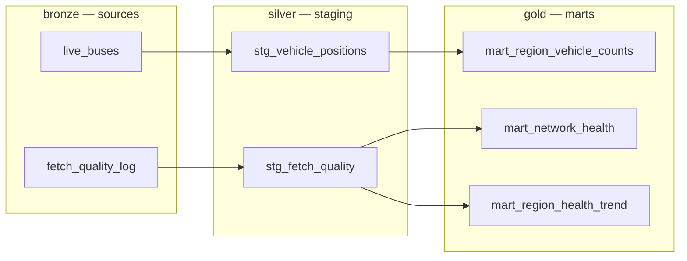

# dbt Analytics Layer Implementation Plan

> **For agentic workers:** REQUIRED SUB-SKILL: Use superpowers:subagent-driven-development (recommended) or superpowers:executing-plans to implement this plan task-by-task. Steps use checkbox (`- [ ]`) syntax for tracking.

**Goal:** Introduce a tested, documented dbt (dbt-duckdb) transformation layer that replaces the hand-written analytical SQL in `src/utils/db.py`, without touching the live-map path.

**Architecture:** dbt reads the two app-created tables (`live_buses`, `fetch_quality_log`) as **sources**, exposes cleaned **staging views**, and builds three **mart views** (all `materialized: view`). The duplicated reliability-score formula becomes a single dbt macro. The Streamlit app bootstraps the views once (after the first ingestion creates the tables) by shelling out to `dbt run`; thereafter `db.py` reads marts with thin `SELECT`s. CI runs `dbt build` (seed → run → test) plus the existing pytest suite.

**Tech Stack:** Python 3.8+, dbt-core + dbt-duckdb, dbt_utils, DuckDB, Streamlit, pytest, GitHub Actions.

## Global Constraints

- Python floor: `>=3.8` (matches `pyproject.toml`).
- Marts are DuckDB **views** only — never tables/incremental (avoids the DuckDB single-writer lock).
- The live path is **untouched**: `get_live_data_optimized` and `get_vehicle_trail` in `src/utils/db.py` must not change.
- dbt project lives at repo-root `transform/`. dbt is invoked with `--project-dir transform --profiles-dir transform`.
- DuckDB file path is passed to dbt via env var `DBT_DUCKDB_PATH` (absolute path); profile default is `../src/agustiar_analytics.duckdb`.
- The 14 canonical regions are exactly the `REGIONS` list in `src/config.example.py`.
- Reliability score formula (verbatim): `ROUND((0.4*reporting_rate + 0.4*availability + 0.2*GREATEST(0.0, 1.0 - avg_lag/300.0)) * 100)`.
- Per `CLAUDE.md`: this is a feature → bump to **2.2.0** across `CHANGELOG.md`, `README.md`, `pyproject.toml`; keep `requirements.txt`/`requirements-dev.txt` aligned with `pyproject.toml`.
- Every task ends by committing on branch `feature/dbt-analytics-layer`.

---

### Task 1: dbt project scaffold + dependency wiring

**Files:**
- Create: `transform/dbt_project.yml`
- Create: `transform/profiles.yml`
- Create: `transform/packages.yml`
- Create: `transform/.gitignore`
- Modify: `requirements.txt` (add dbt), `requirements-dev.txt` (unchanged — inherits), `pyproject.toml` (add dbt dep)

**Interfaces:**
- Produces: a runnable dbt project resolvable via `dbt debug --project-dir transform --profiles-dir transform`.

- [ ] **Step 1: Create `transform/dbt_project.yml`**

```yaml
name: 'transit_transform'
version: '2.2.0'
config-version: 2
profile: 'transit'

model-paths: ["models"]
macro-paths: ["macros"]
seed-paths: ["seeds"]
target-path: "target"
clean-targets: ["target", "dbt_packages"]

vars:
  # Widened in CI so fixed-timestamp seeds fall inside the windows.
  health_window_hours: 24
  retention_days: 7

models:
  transit_transform:
    staging:
      +materialized: view
    marts:
      +materialized: view
```

- [ ] **Step 2: Create `transform/profiles.yml`**

```yaml
transit:
  target: dev
  outputs:
    dev:
      type: duckdb
      path: "{{ env_var('DBT_DUCKDB_PATH', '../src/agustiar_analytics.duckdb') }}"
      schema: main
      threads: 1
```

- [ ] **Step 3: Create `transform/packages.yml`**

```yaml
packages:
  - package: dbt-labs/dbt_utils
    version: [">=1.1.0", "<2.0.0"]
```

- [ ] **Step 4: Create `transform/.gitignore`**

```gitignore
target/
dbt_packages/
logs/
```

- [ ] **Step 5: Add dbt to `requirements.txt`**

Append under a new section:

```
# Analytics transformation layer
dbt-duckdb>=1.7.0,<2.0.0
```

- [ ] **Step 6: Add dbt to `pyproject.toml` dependencies**

In the `dependencies = [ ... ]` array, add as the final entry:

```toml
    "dbt-duckdb>=1.7.0,<2.0.0",
```

- [ ] **Step 7: Install and verify**

Run:
```bash
pip install -r requirements.txt
dbt deps --project-dir transform --profiles-dir transform
dbt debug --project-dir transform --profiles-dir transform
```
Expected: `dbt deps` installs dbt_utils; `dbt debug` ends with `All checks passed!`

- [ ] **Step 8: Commit**

```bash
git add transform/ requirements.txt pyproject.toml
git commit -m "chore: scaffold dbt-duckdb project (transform/)

Co-Authored-By: Claude Opus 4.8 <noreply@anthropic.com>"
```

---

### Task 2: Sources, staging views, and CI seed fixtures

**Files:**
- Create: `transform/models/staging/_sources.yml`
- Create: `transform/models/staging/stg_vehicle_positions.sql`
- Create: `transform/models/staging/stg_fetch_quality.sql`
- Create: `transform/models/staging/_staging.yml`
- Create: `transform/seeds/live_buses.csv`
- Create: `transform/seeds/fetch_quality_log.csv`

**Interfaces:**
- Produces:
  - `stg_vehicle_positions(region, vehicle_id, latitude, longitude, bearing, speed_kmh, timestamp, insert_timestamp)` — view; invalid coords removed; speed converted m/s→km/h and capped at 120.
  - `stg_fetch_quality(fetch_timestamp, region, vehicles_received, vehicles_rejected, vehicles_inserted, avg_data_lag_seconds, max_data_lag_seconds, total_dropout, fetch_duration_ms)` — typed passthrough view.

- [ ] **Step 1: Create `transform/seeds/live_buses.csv`** (CI fixture — schema matches the app table)

```csv
region,vehicle_id,latitude,longitude,bearing,speed,timestamp,trip_id,route_id,insert_timestamp,created_at
TestRegion,V1,3.14,101.68,90,10.0,1750000000,T1,R1,1750000000,2025-06-15 12:00:00
TestRegion,V1,3.15,101.69,92,0.0,1750000060,T1,R1,1750000060,2025-06-15 12:01:00
TestRegion,V2,3.20,101.70,45,20.0,1750000000,T2,R2,1750000000,2025-06-15 12:00:00
BadCoords,V9,0.0,0.0,0,5.0,1750000000,T9,R9,1750000000,2025-06-15 12:00:00
```

- [ ] **Step 2: Create `transform/seeds/fetch_quality_log.csv`** (CI fixture — schema matches the app table)

```csv
fetch_timestamp,region,vehicles_received,vehicles_rejected,vehicles_inserted,avg_data_lag_seconds,max_data_lag_seconds,total_dropout,fetch_duration_ms
1750000000,TestRegion,10,2,8,30.0,60.0,false,120
1750000060,TestRegion,10,0,10,0.0,0.0,false,110
```

- [ ] **Step 3: Create `transform/models/staging/_sources.yml`**

```yaml
version: 2

sources:
  - name: transit
    schema: main
    tables:
      - name: live_buses
      - name: fetch_quality_log
        loaded_at_field: to_timestamp(fetch_timestamp)
        freshness:
          warn_after: {count: 30, period: minute}
          error_after: {count: 120, period: minute}
```

- [ ] **Step 4: Create `transform/models/staging/stg_vehicle_positions.sql`**

```sql
with source as (
    select * from {{ source('transit', 'live_buses') }}
)
select
    region,
    cast(vehicle_id as varchar)            as vehicle_id,
    cast(latitude as double)               as latitude,
    cast(longitude as double)              as longitude,
    coalesce(cast(bearing as double), 0)   as bearing,
    least(round(coalesce(cast(speed as double), 0) * 3.6), 120) as speed_kmh,
    cast(timestamp as bigint)              as timestamp,
    cast(insert_timestamp as bigint)       as insert_timestamp
from source
where latitude is not null
  and longitude is not null
  and latitude <> 0
  and longitude <> 0
```

- [ ] **Step 5: Create `transform/models/staging/stg_fetch_quality.sql`**

```sql
with source as (
    select * from {{ source('transit', 'fetch_quality_log') }}
)
select
    cast(fetch_timestamp as bigint)         as fetch_timestamp,
    region,
    cast(vehicles_received as integer)      as vehicles_received,
    cast(vehicles_rejected as integer)      as vehicles_rejected,
    cast(vehicles_inserted as integer)      as vehicles_inserted,
    cast(avg_data_lag_seconds as double)    as avg_data_lag_seconds,
    cast(max_data_lag_seconds as double)    as max_data_lag_seconds,
    cast(total_dropout as boolean)          as total_dropout,
    cast(fetch_duration_ms as integer)      as fetch_duration_ms
from source
```

- [ ] **Step 6: Create `transform/models/staging/_staging.yml`** (tests)

```yaml
version: 2

models:
  - name: stg_vehicle_positions
    columns:
      - name: vehicle_id
        tests: [not_null]
      - name: speed_kmh
        tests:
          - dbt_utils.accepted_range:
              min_value: 0
              max_value: 120
  - name: stg_fetch_quality
    columns:
      - name: fetch_timestamp
        tests: [not_null]
      - name: region
        tests: [not_null]
```

- [ ] **Step 7: Build and test with widened windows**

Run:
```bash
DBT_DUCKDB_PATH="$(pwd)/transform/ci_test.duckdb" \
  dbt build --project-dir transform --profiles-dir transform \
  --vars '{health_window_hours: 876000, retention_days: 40000}'
```
Expected: seeds load, staging views build, all staging tests PASS. `stg_vehicle_positions` excludes the `BadCoords` row (0/0 coords).

- [ ] **Step 8: Commit**

```bash
rm -f transform/ci_test.duckdb
git add transform/models/staging transform/seeds
git commit -m "feat: add dbt sources, staging views, and CI seed fixtures

Co-Authored-By: Claude Opus 4.8 <noreply@anthropic.com>"
```

---

### Task 3: reliability_score macro + `mart_network_health`

**Files:**
- Create: `transform/macros/reliability_score.sql`
- Create: `transform/models/marts/mart_network_health.sql`
- Create: `transform/models/marts/_marts.yml`

**Interfaces:**
- Consumes: `stg_fetch_quality` (Task 2).
- Produces: `mart_network_health(region, total_fetches, dropout_count, reporting_rate, availability, avg_data_lag_seconds, last_fetch_timestamp, reliability_score)` — one row per region over the last `health_window_hours` (default 24h). Columns match the legacy `get_network_health_summary` output exactly.
- Produces macro `reliability_score(reporting_rate, availability, avg_lag_seconds)` returning the rounded 0–100 score expression.

- [ ] **Step 1: Create the failing test** — `tests/test_dbt_marts.py`

```python
import os
import subprocess
import duckdb
import pytest

REPO = os.path.dirname(os.path.dirname(os.path.abspath(__file__)))
TRANSFORM = os.path.join(REPO, "transform")


@pytest.fixture(scope="module")
def built_db(tmp_path_factory):
    db_path = tmp_path_factory.mktemp("dbt") / "test.duckdb"
    env = {**os.environ, "DBT_DUCKDB_PATH": str(db_path)}
    common = ["--project-dir", TRANSFORM, "--profiles-dir", TRANSFORM,
              "--vars", "{health_window_hours: 876000, retention_days: 40000}"]
    # Seed first: dbt has no DAG edge between a seed and a same-named source(),
    # so `dbt build` alone can run models before seeds load on a fresh DB.
    subprocess.run(["dbt", "seed", *common], check=True, env=env, cwd=REPO)
    subprocess.run(["dbt", "build", *common], check=True, env=env, cwd=REPO)
    con = duckdb.connect(str(db_path))
    yield con
    con.close()


def test_network_health_score_matches_hand_computation(built_db):
    row = built_db.execute(
        "SELECT reporting_rate, availability, avg_data_lag_seconds, "
        "dropout_count, total_fetches, reliability_score "
        "FROM main.mart_network_health WHERE region = 'TestRegion'"
    ).fetchone()
    reporting_rate, availability, avg_lag, dropouts, fetches, score = row
    assert round(reporting_rate, 4) == 0.9      # avg(0.8, 1.0)
    assert round(availability, 4) == 1.0        # no dropouts
    assert round(avg_lag, 4) == 15.0            # avg(30, 0)
    assert dropouts == 0
    assert fetches == 2
    assert score == 95                          # round((0.36+0.40+0.19)*100)
```

- [ ] **Step 2: Run it and confirm it fails**

Run: `pytest tests/test_dbt_marts.py -v`
Expected: FAIL — `mart_network_health` does not exist yet (dbt build errors).

- [ ] **Step 3: Create `transform/macros/reliability_score.sql`**

```sql

round((
      0.4 * ({{ reporting_rate }})
    + 0.4 * ({{ availability }})
    + 0.2 * greatest(0.0, 1.0 - ({{ avg_lag_seconds }}) / 300.0)
) * 100)

```

- [ ] **Step 4: Create `transform/models/marts/mart_network_health.sql`**

```sql


with q as (
    select * from {{ ref('stg_fetch_quality') }}
    where fetch_timestamp >= {{ cutoff }}
),
agg as (
    select
        region,
        count(*)                                             as total_fetches,
        sum(case when total_dropout then 1 else 0 end)       as dropout_count,
        coalesce(avg(case when vehicles_received > 0
            then vehicles_inserted::double / vehicles_received end), 0) as reporting_rate,
        1.0 - sum(case when total_dropout then 1 else 0 end)::double
              / count(*)                                     as availability,
        coalesce(avg(avg_data_lag_seconds), 0)               as avg_data_lag_seconds,
        max(fetch_timestamp)                                 as last_fetch_timestamp
    from q
    group by region
)
select
    region,
    total_fetches,
    dropout_count,
    reporting_rate,
    availability,
    avg_data_lag_seconds,
    last_fetch_timestamp,
    {{ reliability_score('reporting_rate', 'availability', 'avg_data_lag_seconds') }} as reliability_score
from agg
order by reliability_score desc
```

- [ ] **Step 5: Create `transform/models/marts/_marts.yml`**

```yaml
version: 2

models:
  - name: mart_network_health
    columns:
      - name: region
        tests:
          - not_null
          - unique
          - accepted_values:
              values: ['Rapid Bus KL','Rapid Bus MRT Feeder','Rapid Bus Kuantan',
                       'Rapid Bus Penang','KTM Berhad','myBAS Kangar','myBAS Alor Setar',
                       'myBAS Kota Bharu','myBAS Kuala Terengganu','myBAS Ipoh',
                       'myBAS Seremban','myBAS Melaka','myBAS Johor','myBAS Kuching',
                       'TestRegion']
      - name: reliability_score
        tests:
          - dbt_utils.accepted_range: {min_value: 0, max_value: 100}
      - name: reporting_rate
        tests:
          - dbt_utils.accepted_range: {min_value: 0, max_value: 1}
```

- [ ] **Step 6: Run the test and confirm it passes**

Run: `pytest tests/test_dbt_marts.py -v`
Expected: PASS.

- [ ] **Step 7: Commit**

```bash
git add transform/macros transform/models/marts tests/test_dbt_marts.py
git commit -m "feat: add reliability_score macro and mart_network_health

Co-Authored-By: Claude Opus 4.8 <noreply@anthropic.com>"
```

---

### Task 4: `mart_region_health_trend`

**Files:**
- Create: `transform/models/marts/mart_region_health_trend.sql`
- Modify: `transform/models/marts/_marts.yml` (add model block)
- Modify: `tests/test_dbt_marts.py` (add test)

**Interfaces:**
- Consumes: `stg_fetch_quality` (Task 2), `reliability_score` macro (Task 3).
- Produces: `mart_region_health_trend(region, fetch_timestamp, vehicles_received, vehicles_rejected, vehicles_inserted, avg_data_lag_seconds, max_data_lag_seconds, total_dropout, reliability_score)` — one row per region per fetch cycle, **no time filter** (the app applies its own window). Per-row `reliability_score` uses the same macro.

- [ ] **Step 1: Add the failing test** to `tests/test_dbt_marts.py`

```python
def test_region_health_trend_per_row_score(built_db):
    rows = built_db.execute(
        "SELECT fetch_timestamp, reliability_score "
        "FROM main.mart_region_health_trend "
        "WHERE region = 'TestRegion' ORDER BY fetch_timestamp"
    ).fetchall()
    # Row 1: reporting 0.8, avail 1.0, lag 30 -> round((0.32+0.4+0.18)*100)=90
    # Row 2: reporting 1.0, avail 1.0, lag 0  -> round((0.4+0.4+0.2)*100)=100
    assert [r[1] for r in rows] == [90, 100]
```

- [ ] **Step 2: Run it and confirm it fails**

Run: `pytest tests/test_dbt_marts.py::test_region_health_trend_per_row_score -v`
Expected: FAIL — `mart_region_health_trend` does not exist.

- [ ] **Step 3: Create `transform/models/marts/mart_region_health_trend.sql`**

```sql
select
    region,
    fetch_timestamp,
    vehicles_received,
    vehicles_rejected,
    vehicles_inserted,
    avg_data_lag_seconds,
    max_data_lag_seconds,
    total_dropout,
    {{ reliability_score(
        'case when vehicles_received > 0 then vehicles_inserted::double / vehicles_received else 0 end',
        'case when total_dropout then 0.0 else 1.0 end',
        'avg_data_lag_seconds'
    ) }} as reliability_score
from {{ ref('stg_fetch_quality') }}
```

- [ ] **Step 4: Add model block to `transform/models/marts/_marts.yml`**

```yaml
  - name: mart_region_health_trend
    columns:
      - name: region
        tests: [not_null]
      - name: fetch_timestamp
        tests: [not_null]
      - name: reliability_score
        tests:
          - dbt_utils.accepted_range: {min_value: 0, max_value: 100}
```

- [ ] **Step 5: Run the test and confirm it passes**

Run: `pytest tests/test_dbt_marts.py -v`
Expected: PASS (both mart tests).

- [ ] **Step 6: Commit**

```bash
git add transform/models/marts/mart_region_health_trend.sql transform/models/marts/_marts.yml tests/test_dbt_marts.py
git commit -m "feat: add mart_region_health_trend with per-row reliability score

Co-Authored-By: Claude Opus 4.8 <noreply@anthropic.com>"
```

---

### Task 5: `mart_region_vehicle_counts` (analytics)

**Files:**
- Create: `transform/models/marts/mart_region_vehicle_counts.sql`
- Modify: `transform/models/marts/_marts.yml` (add model block)
- Modify: `tests/test_dbt_marts.py` (add test)

**Interfaces:**
- Consumes: `stg_vehicle_positions` (Task 2).
- Produces: `mart_region_vehicle_counts(region, unique_vehicles)` — one row per region, distinct `vehicle_id` count over the last `retention_days`. Single source of truth for the Analytics "Buses by Region" bar and "Regional Distribution" pie.

- [ ] **Step 1: Add the failing test** to `tests/test_dbt_marts.py`

```python
def test_region_vehicle_counts(built_db):
    count = built_db.execute(
        "SELECT unique_vehicles FROM main.mart_region_vehicle_counts "
        "WHERE region = 'TestRegion'"
    ).fetchone()[0]
    assert count == 2  # V1 and V2 (BadCoords row filtered out in staging)
```

- [ ] **Step 2: Run it and confirm it fails**

Run: `pytest tests/test_dbt_marts.py::test_region_vehicle_counts -v`
Expected: FAIL — `mart_region_vehicle_counts` does not exist.

- [ ] **Step 3: Create `transform/models/marts/mart_region_vehicle_counts.sql`**

```sql
-- cast the var to bigint: with widened CI vars, days * 86400 overflows DuckDB's INT32 literal math


select
    region,
    count(distinct vehicle_id) as unique_vehicles
from {{ ref('stg_vehicle_positions') }}
where insert_timestamp >= {{ cutoff }}
group by region
order by unique_vehicles desc
```

- [ ] **Step 4: Add model block to `transform/models/marts/_marts.yml`**

```yaml
  - name: mart_region_vehicle_counts
    columns:
      - name: region
        tests: [not_null, unique]
      - name: unique_vehicles
        tests:
          - dbt_utils.accepted_range: {min_value: 0}
```

- [ ] **Step 5: Run the test and confirm it passes**

Run: `pytest tests/test_dbt_marts.py -v`
Expected: PASS (all three mart tests).

- [ ] **Step 6: Commit**

```bash
git add transform/models/marts/mart_region_vehicle_counts.sql transform/models/marts/_marts.yml tests/test_dbt_marts.py
git commit -m "feat: add mart_region_vehicle_counts for analytics region charts

Co-Authored-By: Claude Opus 4.8 <noreply@anthropic.com>"
```

---

### Task 6: dbt bootstrap runner

**Files:**
- Create: `src/utils/dbt_runner.py`
- Create: `tests/test_dbt_runner.py`

**Interfaces:**
- Produces:
  - `dbt_runner.marts_exist(con) -> bool` — True if `mart_network_health` view is present.
  - `dbt_runner.ensure_dbt_models(database_name) -> bool` — if the marts view is absent, shells out to `dbt run` with `DBT_DUCKDB_PATH` set to the absolute DB path; returns True if a build ran, False if skipped. Swallows lock/CLI errors (prints, returns False) so ingestion never crashes.

- [ ] **Step 1: Write the failing test** — `tests/test_dbt_runner.py`

```python
import duckdb
from utils import dbt_runner


def test_marts_exist_false_on_empty_db(tmp_path):
    db = tmp_path / "empty.duckdb"
    con = duckdb.connect(str(db))
    try:
        assert dbt_runner.marts_exist(con) is False
    finally:
        con.close()


def test_marts_exist_true_when_view_present(tmp_path):
    db = tmp_path / "with_view.duckdb"
    con = duckdb.connect(str(db))
    try:
        con.execute("CREATE VIEW mart_network_health AS SELECT 1 AS region")
        assert dbt_runner.marts_exist(con) is True
    finally:
        con.close()
```

- [ ] **Step 2: Run it and confirm it fails**

Run: `cd src && python -m pytest ../tests/test_dbt_runner.py -v`
Expected: FAIL — `No module named 'utils.dbt_runner'`.

- [ ] **Step 3: Create `src/utils/dbt_runner.py`**

```python
import os
import subprocess

_REPO_ROOT = os.path.dirname(os.path.dirname(os.path.dirname(os.path.abspath(__file__))))
_TRANSFORM_DIR = os.path.join(_REPO_ROOT, "transform")
_SENTINEL_VIEW = "mart_network_health"


def marts_exist(con):
    """Return True if the dbt mart views have already been created in this DB."""
    row = con.execute(
        "SELECT count(*) FROM information_schema.tables WHERE table_name = ?",
        [_SENTINEL_VIEW],
    ).fetchone()
    return row[0] > 0


def ensure_dbt_models(database_name):
    """
    Create the dbt mart views once, after the source tables exist.
    No-op if the views are already present. Never raises — a failed or
    unavailable dbt run must not break ingestion.
    Returns True if `dbt run` was invoked, False if skipped/failed.
    """
    db_path = os.path.abspath(database_name)
    try:
        con = __import__("duckdb").connect(db_path)
        try:
            if marts_exist(con):
                return False
        finally:
            con.close()
    except Exception as e:
        print(f"dbt bootstrap check skipped: {e}")
        return False

    env = {**os.environ, "DBT_DUCKDB_PATH": db_path}
    try:
        subprocess.run(
            ["dbt", "run", "--project-dir", _TRANSFORM_DIR,
             "--profiles-dir", _TRANSFORM_DIR],
            check=True, env=env, cwd=_REPO_ROOT,
            capture_output=True, text=True, timeout=120,
        )
        print("✓ dbt marts created")
        return True
    except Exception as e:
        print(f"dbt run skipped/failed (non-fatal): {e}")
        return False
```

- [ ] **Step 4: Run the test and confirm it passes**

Run: `cd src && python -m pytest ../tests/test_dbt_runner.py -v`
Expected: PASS.

- [ ] **Step 5: Commit**

```bash
git add src/utils/dbt_runner.py tests/test_dbt_runner.py
git commit -m "feat: add dbt bootstrap runner (creates mart views once)

Co-Authored-By: Claude Opus 4.8 <noreply@anthropic.com>"
```

---

### Task 7: Rewire `db.py` reads and `ingestion.py` bootstrap

**Files:**
- Modify: `src/utils/db.py` (`get_network_health_summary`, `get_region_health_trend`, add `get_region_vehicle_counts`)
- Modify: `src/utils/ingestion.py` (call `ensure_dbt_models` after a successful store)
- Modify: `src/app_pages/analytics.py` (use the new counts function for bar + pie)

**Interfaces:**
- Consumes: marts from Tasks 3–5; `dbt_runner.ensure_dbt_models` from Task 6.
- Produces: `db.get_region_vehicle_counts() -> DataFrame['Region','Count']`.

- [ ] **Step 1: Replace the body of `get_network_health_summary`** in `src/utils/db.py` (keep the signature and the `_quality_log_exists()` early return; swap the transformation SQL for a mart read)

```python
def get_network_health_summary(window_hours=24):
    """Per-region reliability summary. Reads the dbt mart (fixed 24h window)."""
    if not _quality_log_exists():
        return pd.DataFrame()
    con = get_connection()
    try:
        if con.execute(
            "SELECT count(*) FROM information_schema.tables WHERE table_name = 'mart_network_health'"
        ).fetchone()[0] == 0:
            return pd.DataFrame()
        return con.execute("SELECT * FROM main.mart_network_health").df()
    finally:
        con.close()
```

- [ ] **Step 2: Replace the query inside `get_region_health_trend`** in `src/utils/db.py` (keep the signature, the `_quality_log_exists()` guard, and the trailing `datetime` timezone conversion block unchanged)

```python
    cutoff = int(time.time()) - int(window_hours * 3600)
    con = get_connection()
    try:
        if con.execute(
            "SELECT count(*) FROM information_schema.tables WHERE table_name = 'mart_region_health_trend'"
        ).fetchone()[0] == 0:
            return pd.DataFrame()
        query = """
        SELECT fetch_timestamp, vehicles_received, vehicles_rejected, vehicles_inserted,
               avg_data_lag_seconds, max_data_lag_seconds, total_dropout, reliability_score
        FROM main.mart_region_health_trend
        WHERE region = ? AND fetch_timestamp >= ?
        ORDER BY fetch_timestamp ASC
        """
        df = con.execute(query, [region, cutoff]).df()
    finally:
        con.close()
```

- [ ] **Step 3: Add `get_region_vehicle_counts`** to `src/utils/db.py` (after `get_historical_data`)

```python
def get_region_vehicle_counts():
    """Unique vehicles per region from the dbt mart. Columns: Region, Count."""
    if not table_exists():
        return pd.DataFrame(columns=['Region', 'Count'])
    con = get_connection()
    try:
        if con.execute(
            "SELECT count(*) FROM information_schema.tables WHERE table_name = 'mart_region_vehicle_counts'"
        ).fetchone()[0] == 0:
            return pd.DataFrame(columns=['Region', 'Count'])
        df = con.execute(
            "SELECT region AS \"Region\", unique_vehicles AS \"Count\" "
            "FROM main.mart_region_vehicle_counts"
        ).df()
    finally:
        con.close()
    return df
```

- [ ] **Step 4: Bootstrap the marts after a successful store** in `src/utils/ingestion.py`

At the very end of `fetch_and_store_transit_data`, after the `_write_quality_log(quality_stats)` line, append:

```python
    # Create dbt mart views once the source tables exist (no-op thereafter).
    try:
        from utils.dbt_runner import ensure_dbt_models
    except ImportError:
        from dbt_runner import ensure_dbt_models
    ensure_dbt_models(DATABASE_NAME)
```

- [ ] **Step 5: Use the mart in `src/app_pages/analytics.py`** — replace the `region_counts` derivation (currently `df_historical.groupby('region')['vehicle_id'].nunique()...`) with:

```python
        region_counts = db.get_region_vehicle_counts()
        if region_counts.empty:
            region_counts = pd.DataFrame(columns=['Region', 'Count'])
        region_counts = region_counts.sort_values('Count', ascending=True)
```

(The `fig3` pie already consumes `region_counts` — no further change there.)

- [ ] **Step 6: Verify the full suite passes**

Run:
```bash
cd src && python -m pytest ../tests -v
```
Expected: PASS — existing tests plus the dbt mart/runner tests.

- [ ] **Step 7: Manual parity smoke check** (documented, not automated)

Run the app (`cd src && streamlit run app.py`), click **Refresh Data** twice, open **Network Health** and **Analytics**. Confirm scorecards, sparklines, drill-down, the Buses-by-Region bar, and the Regional-Distribution pie all render with data.

- [ ] **Step 8: Commit**

```bash
git add src/utils/db.py src/utils/ingestion.py src/app_pages/analytics.py
git commit -m "refactor: read Network Health + region counts from dbt marts

Co-Authored-By: Claude Opus 4.8 <noreply@anthropic.com>"
```

---

### Task 8: GitHub Actions CI

**Files:**
- Create: `.github/workflows/ci.yml`

**Interfaces:**
- Produces: CI that runs `dbt build` (seed → run → test) then pytest on every push/PR.

- [ ] **Step 1: Create `.github/workflows/ci.yml`**

```yaml
name: CI

on:
  push:
  pull_request:

jobs:
  build-and-test:
    runs-on: ubuntu-latest
    steps:
      - uses: actions/checkout@v4
      - uses: actions/setup-python@v5
        with:
          python-version: '3.11'
      - name: Install dependencies
        run: |
          pip install -r requirements.txt
          pip install -r requirements-dev.txt
      - name: dbt deps
        run: dbt deps --project-dir transform --profiles-dir transform
      - name: dbt build (seed + run + test)
        env:
          DBT_DUCKDB_PATH: ${{ github.workspace }}/ci.duckdb
        run: |
          dbt seed --project-dir transform --profiles-dir transform \
            --vars '{health_window_hours: 876000, retention_days: 40000}'
          dbt build --project-dir transform --profiles-dir transform \
            --vars '{health_window_hours: 876000, retention_days: 40000}'
      - name: pytest
        run: cd src && python -m pytest ../tests -v
```

- [ ] **Step 2: Validate the workflow locally** (syntax + the exact commands it runs)

Run:
```bash
export DBT_DUCKDB_PATH="$(pwd)/ci.duckdb"
dbt seed --project-dir transform --profiles-dir transform --vars '{health_window_hours: 876000, retention_days: 40000}'
dbt build --project-dir transform --profiles-dir transform --vars '{health_window_hours: 876000, retention_days: 40000}'
cd src && python -m pytest ../tests -v && cd ..
rm -f ci.duckdb
```
Expected: dbt seed loads 2 seeds; dbt build all PASS; pytest all PASS.

- [ ] **Step 3: Commit**

```bash
git add .github/workflows/ci.yml
git commit -m "ci: run dbt build + pytest on push and PR

Co-Authored-By: Claude Opus 4.8 <noreply@anthropic.com>"
```

---

### Task 9: Docs, lineage diagram, and version bump (2.2.0)

**Files:**
- Modify: `README.md` (new "Data Modeling (dbt)" section + CI badge + dependency list)
- Modify: `CHANGELOG.md` (new `[2.2.0]` section)
- Modify: `pyproject.toml` (version → 2.2.0)

**Interfaces:** none (documentation only).

- [ ] **Step 1: Verify the docs artifacts generate**

The lineage graph goes into the README as a **Mermaid diagram** (GitHub renders Mermaid
natively; it is version-controlled and cannot go stale the way a committed screenshot
does) rather than a PNG. This step only confirms `dbt docs generate` succeeds, so the
full interactive graph is available locally via `dbt docs serve`.

Run:
```bash
export DBT_DUCKDB_PATH="$(pwd)/docs_build.duckdb"
dbt seed --project-dir transform --profiles-dir transform --vars '{health_window_hours: 876000, retention_days: 40000}'
dbt build --project-dir transform --profiles-dir transform --vars '{health_window_hours: 876000, retention_days: 40000}'
dbt docs generate --project-dir transform --profiles-dir transform
```
Expected: completes and writes `transform/target/index.html` and `transform/target/manifest.json`.
Confirm both exist, then `rm -f docs_build.duckdb`. Nothing under `transform/target/` is
committed (already gitignored).

- [ ] **Step 2: Add the `[2.2.0]` section to `CHANGELOG.md`** (above `[2.1.2]`)

```markdown
## [2.2.0] - 2026-07-29

### Added
- **dbt (dbt-duckdb) analytics layer** under `transform/` — bronze sources (`live_buses`, `fetch_quality_log`), silver staging views, and three gold mart views (`mart_network_health`, `mart_region_health_trend`, `mart_region_vehicle_counts`)
- `reliability_score` dbt macro — single definition of the 0–100 score formula, replacing the copy in two `db.py` functions
- dbt data tests: region `accepted_values`, score/rate range checks, key `not_null`/`unique`, plus `fetch_quality_log` source freshness
- GitHub Actions CI running `dbt build` (seed → run → test) and pytest on every push/PR
- `dbt_runner.ensure_dbt_models` — creates the mart views once after the first ingestion (bootstraps Streamlit Cloud)
- Model lineage diagram (Mermaid) in the README's new "Data Modeling (dbt)" section

### Changed
- Network Health reads (`get_network_health_summary`, `get_region_health_trend`) and the Analytics region charts now query dbt marts instead of inline SQL; the live-map path is unchanged
```

- [ ] **Step 3: Add a "Data Modeling (dbt)" section to `README.md`** (after "Technical Details"), and a CI badge under the existing badges

CI badge (add beneath the License badge near the top):
```markdown
[](https://github.com/agustiarfalahi94/agustiar-data-pipeline/actions/workflows/ci.yml)
```

Section body:
```markdown
### Data Modeling (dbt)

Analytical transformations live in a dbt project (`transform/`, dbt-duckdb adapter) as a
bronze → silver → gold medallion model. The live-map path stays on direct DuckDB queries for
sub-minute freshness; only the analytical pages read dbt marts.

| Layer | Model | Grain | Feeds |
|---|---|---|---|
| source (bronze) | `live_buses`, `fetch_quality_log` | raw rows | — |
| staging (silver) | `stg_vehicle_positions`, `stg_fetch_quality` | cleaned rows | marts |
| mart (gold) | `mart_network_health` | region (24h) | Network Health scorecards |
| mart (gold) | `mart_region_health_trend` | region × fetch cycle | drill-down charts |
| mart (gold) | `mart_region_vehicle_counts` | region | Analytics bar + pie |

The reliability-score formula is a single dbt macro (`reliability_score`) shared by the two
health marts. Data quality is enforced by dbt tests (region `accepted_values`, 0–100 score range,
0–1 rate range, key uniqueness) and source freshness, run in CI via `dbt build`.



Run locally:

    export DBT_DUCKDB_PATH="$(pwd)/src/agustiar_analytics.duckdb"
    dbt build --project-dir transform --profiles-dir transform

For the full interactive lineage graph:

    dbt docs generate --project-dir transform --profiles-dir transform
    dbt docs serve --project-dir transform --profiles-dir transform
```

Also add `dbt-duckdb>=1.7.0` to the README "Dependencies" code block.

- [ ] **Step 4: Bump `pyproject.toml`**

Change `version = "2.1.2"` to `version = "2.2.0"`.

- [ ] **Step 5: Verify alignment** (per CLAUDE.md pre-finish check)

Confirm `README.md`, `CHANGELOG.md`, `pyproject.toml`, and `requirements.txt` all reference dbt-duckdb and version 2.2.0 consistently. Run:
```bash
grep -n "2.2.0" CHANGELOG.md pyproject.toml
grep -n "dbt-duckdb" requirements.txt README.md pyproject.toml
```
Expected: version present in CHANGELOG + pyproject; dbt-duckdb present in all three.

- [ ] **Step 6: Commit**

```bash
git add README.md CHANGELOG.md pyproject.toml
git commit -m "docs: document dbt layer, add lineage diagram, bump to 2.2.0

Co-Authored-By: Claude Opus 4.8 <noreply@anthropic.com>"
```

---

## Self-Review Notes

- **Spec coverage:** sources+freshness (T2), staging (T2), 3 marts as views (T3–T5), score macro (T3), data tests (T2–T5), `db.py` slimmed (T7), bootstrap-on-first-run (T6–T7), lineage docs + README section (T9), CI (T8), version/changelog/requirements alignment (T1, T9). The analytics mart is deliberately scoped to region vehicle counts; the per-vehicle distribution charts (histogram/box/summary stats) stay in pandas — recorded in the spec's roadmap as a later "trip/route performance marts" item.
- **Live path untouched:** confirmed — no task modifies `get_live_data_optimized` or `get_vehicle_trail`.
- **Type consistency:** mart column names (`reliability_score`, `reporting_rate`, `availability`, `avg_data_lag_seconds`, `dropout_count`, `total_fetches`, `last_fetch_timestamp`) match the columns `network_health.py` reads; `get_region_vehicle_counts` returns `Region`/`Count` matching `analytics.py`'s `region_counts` usage.
- **Window handling:** `mart_network_health` bakes the 24h window (only caller uses 24h); `mart_region_health_trend` is window-agnostic and the app filters it — matching current call sites.
